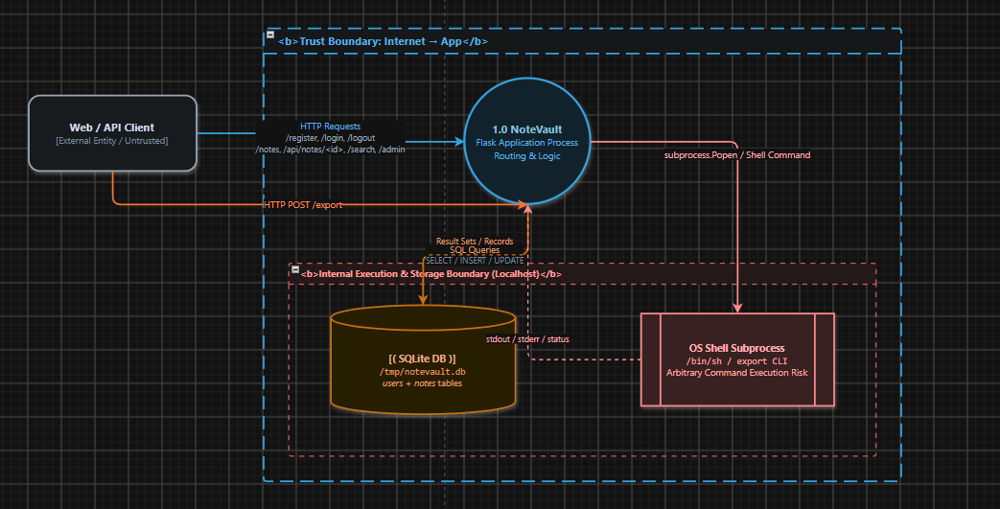
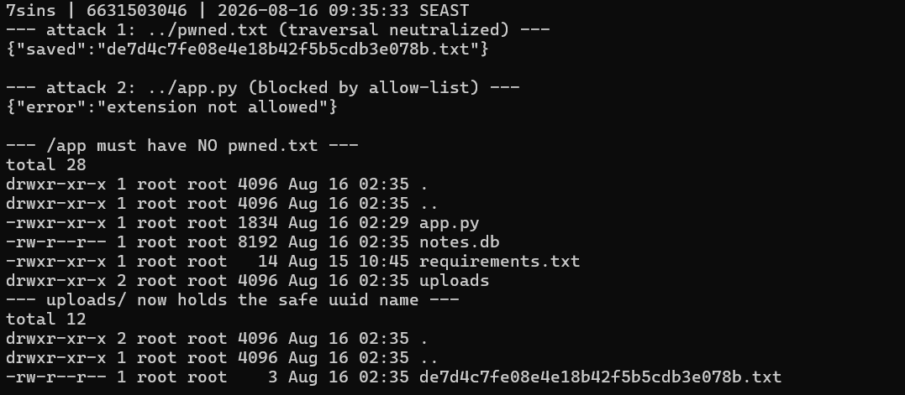
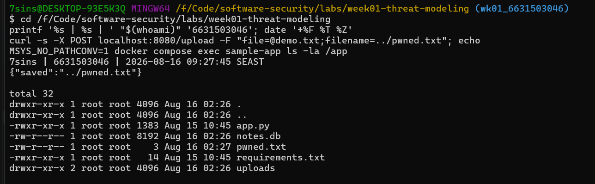

# Worksheet 1 — Security Mindset & Threat Modeling (3 hrs)

> **Course:** Software Security (KOSEN69) · **Week 1**
> **Aligned to:** OWASP 2025 A06 Insecure Design · CWE-501 (Trust Boundary Violation)
> **Signature game:** "Elevation of Privilege" (Microsoft STRIDE card deck)

> **Ethics note:** This week is *modeling only* — you analyze design, you do **not** attack the app. Run the sample app only on your own VM/localhost. Never apply these techniques to systems you do not own or lack written permission to test.

## Part 1 — Student Information
| Name            | Student ID | Date      | Group | 
|-----------------|------------|-----------|-------|
| Athichon kaewla | 6631503046 | 15/8/2569 | —     | 

## Part 2 — Lecture Questions
Answer in your own words (2–4 sentences each).
1. Define the CIA triad and give one concrete failure example for each of the three properties.

   Confidentiality means only authorised parties can read the data. It fails when a database is
   dumped and customer records show up on a forum. Integrity means the data is accurate and is
   changed only by authorised parties in authorised ways; it fails when an attacker edits a
   stored balance or swaps a file while it is in transit. Availability means the system and its
   data are usable when they are needed; it fails when a DDoS or a full disk takes the service
   offline, as in our own `/upload` endpoint with no size limit.

2. What is a *trust boundary*, and why does data crossing one deserve extra scrutiny?

   A trust boundary is a line in the design where data moves between two components that do not
   have the same privilege or the same level of trust — for example the public internet reaching
   the Flask process. Data crossing it deserves extra scrutiny because on the far side the sender
   is no longer under our control, so every assumption about the data's shape, size, origin and
   intent stops being guaranteed and has to be re-established by a check. In the sample app the
   `owner` field crosses that boundary and is trusted anyway (`app.py:23`), which is precisely
   where the spoofing threat comes from.

3. Explain "attack surface." Name two things that increase it in a web app.

   The attack surface is the complete set of points where an attacker can put input into the
   system or read output from it: routes, query parameters, headers, cookies, file uploads, APIs,
   environment variables and dependencies. Two things that increase it: adding a file-upload
   endpoint, which brings a new parser, new writes to the filesystem and new content served back
   out; and pulling in a third-party dependency, because its code and all of its transitive
   dependencies now execute inside the application. Each addition is one more place where a check
   has to exist and can be forgotten.

4. What does each STRIDE letter map to, and which security property does each threat violate?

   | Letter | Threat                 | Property violated |
   |--------|------------------------|-------------------|
   | S      | Spoofing               | Authentication    |
   | T      | Tampering              | Integrity         |
   | R      | Repudiation            | Non-repudiation   |
   | I      | Information disclosure | Confidentiality   |
   | D      | Denial of service      | Availability      |
   | E      | Elevation of privilege | Authorisation     |

5. What does "Secure by Design" (CISA) mean, and how does it differ from bolting security on after release?

   Secure by Design means the vendor takes ownership of the customer's security outcome and
   builds security in from the architecture stage, so that the safe behaviour is the default and
   the customer does not have to configure it correctly to be protected. It differs from bolting
   security on after release because a design decision cannot be patched away later: if a system
   has no concept of a user, or stores uploads in the same directory as its own code, the fix is
   a redesign rather than a patch. A bolt-on control narrows one path while leaving the structure
   that produced the flaw in place, so the next endpoint reopens it.

## Part 3 — Hands-on Lab (180 min)
**Learning goals:** build a data-flow diagram (DFD), apply STRIDE to a real Flask app, rank risks, and propose mitigations.
**Prerequisites:** Docker + Docker Compose in your VM; a drawing tool (draw.io / paper + photo); the Elevation of Privilege deck (print or virtual) — free print-and-play PDF at [github.com/adamshostack/eop](https://github.com/adamshostack/eop).

**Environment setup**
```bash
cd labs/week01-threat-modeling
docker compose up --build           # starts sample-app on http://localhost:8080
curl -s -X POST localhost:8080/notes -H 'Content-Type: application/json' \
     -d '{"owner":"alice","body":"hello"}'   # observe behavior, do not attack
curl -s localhost:8080/notes

echo "demo file" > demo.txt
curl -s -X POST localhost:8080/upload -F "file=@demo.txt"   # observe behavior, do not attack
curl -s localhost:8080/files/demo.txt
```

Source to model lives in `sample-app/app.py`. Template to fill: `THREAT-MODEL-TEMPLATE.md` (copy it, do not edit the original).

**What to submit per task:** the threat/element identified + a screenshot (DFD, table, or running app) + a 2–3 sentence mitigation.

**Task 0 — Onboarding (5 min)** · *Goal:* prove the environment works. *Steps:* `docker compose up`, hit `/notes` and `/files/<name>`, read `sample-app/app.py`. *Deliverable:* screenshot of the running app + the JSON response.


**Task 1 — Draw the DFD (25 min)** · *Goal:* map the system. *Steps:* identify the external entity (web client), the process (Flask app), the data store (`notes.db` SQLite), the `uploads/` store, and the flows for `/notes`, `/upload`, `/files/<name>`; mark the Internet→app trust boundary with a dashed line. *Deliverable:* DFD image embedded in your copy of the template.


**Task 2 — STRIDE the elements (30 min)** · *Goal:* enumerate threats per element. *Steps:* for each element fill the S/T/R/I/D/E grid. Ground it in real code: `/notes` accepts a client-supplied `owner` with no auth (Spoofing); `/upload` saves raw `f.filename` — arbitrary-file-write (Tampering) — and echoes the resolved save path back in its response (Information disclosure); `/files/<name>` reads it back but is comparatively defended (see Task 5); no logging anywhere (Repudiation). *Deliverable:* completed STRIDE table.

Answer: the completed grid is in `THREAT-MODEL.md` §3 (all seven elements from §2, not only the
three endpoints). The elements-and-boundaries table is §2 of the same file.

**Task 3 — Elevation of Privilege game (20 min)** · *Goal:* find threats you missed. *Steps:* play the EoP deck against your DFD; each card you can tie to a real element/flow scores a point; record every valid threat. No printer or scissors? Draw from the digital deck below instead — same 78 cards, same rule. *Deliverable:* list of carded threats + score.

Card 1 — S: An attacker can anonymously connect, because we expect authentication to be done at a higher level
`/notes` flow · Yes, +1 · already in Task 2
No route authenticates (`app.py:19-29`) and compose publishes 8080 straight to the internet, so
there is no higher layer that could be doing the check.

Card 2 — S: Your system ships with a default admin password, and doesn't force a change
N/A · No, 0
No accounts, roles or passwords exist, so there is no default credential to ship. Considered
against the DFD and rejected, not skipped.

Card 3 — T: An attacker can bypass permissions because you don't make names canonical before checking access permissions
`/upload` → `uploads/` · Yes, +1 · new
`app.py:34` joins the raw `f.filename` with no `secure_filename()` and no normalisation, so
`uploads/../app.py` is stored literally and resolved by the OS at open(). Task 2 recorded the
write but not this cause.

Card 4 — T: An attacker can write to a data store your code relies on
`uploads/` + `notes.db` · Yes, +1 · new
`/upload` needs no auth and both stores sit in `/app` with the code, so `../notes.db` reaches the
database the application itself depends on.

Card 5 — R: The system has no logs
Flask process, all endpoints · Yes, +1 · already in Task 2
No logging call exists in `app.py`, so nothing ties a note, upload or download to a request, an
address or a time.

Card 6 — I: An attacker can read information in files or databases with no access controls
`GET /notes` → `notes.db` · Yes, +1 · new
`app.py:27` selects the whole table with no `WHERE` and takes no parameter, so every caller gets
every owner's notes. Task 2 described altering an `owner` parameter that does not exist.

Card 7 — I: An attacker can read the entire channel because it (HTTP, SMTP) isn't encrypted
Internet → App boundary · Yes, +1 · new
`app.py:43` serves plain HTTP with no TLS in front, so notes, uploads and filenames are readable
in transit — and any session token added later would be too.

Card 8 — D: An attacker can make a server unavailable without ever authenticating, and the problem persists after they go away
`/upload` → `uploads/` · Yes, +1 · new
No `MAX_CONTENT_LENGTH` and no rate limit, so uploads exhaust host disk; with no volume declared
the outage does not heal after the attacker stops.

Card 9 — D: An attacker can drain an easily-replaceable battery
N/A · No, 0
Every element on the DFD runs in a container on mains-powered hardware.

Card 10 — E: An attacker can inject a command that the system will run at a higher privilege level
`/upload` → Flask process · Yes, +1 · new
The Dockerfile sets no `USER`, so the write from card 3 lands on `/app/app.py` and executes as
root on the next restart. Task 2 named RCE but not the root container behind it.

Cards drawn: 10 · Tied to the DFD: 8 · Passed: 2 · **Score: 8/10**
Six of the eight scoring cards were not in the Task 2 STRIDE grid, which is what the game is for.

**Mitigation.** Every scoring card is the same shape: client input becoming a path or an
identity with nothing checking it in between. Fix `/upload` with `secure_filename()`, an
extension allow-list and `MAX_CONTENT_LENGTH`, and fix `/notes` with session auth so `owner`
comes from a verified token. Add `USER app` to the Dockerfile and request logging to close the
privilege and repudiation cards.

```sim
eop-deck
```

**Task 3b — Systems-level pass (25 min) 🔭** · *Goal:* find what the per-element grid cannot see. Tasks 2 and 3 enumerate threats **one element at a time**, and that is exactly where threat models are known to stop short — students taught STRIDE alone reliably identify component threats and *discount system-level ones* ([Joshi et al., ASEE 2024](https://arxiv.org/abs/2404.16632)). So do a second pass over the **whole** diagram:


- **Trust boundaries end-to-end.** Follow one request from the client to `notes.db` and back. List every boundary it crosses. Which crossing has no check on it?

- **Assume one element is fully owned.** Pick the Flask process, then the `uploads/` store. For each: what does the attacker now *reach* — not what is it, but where does it get them?
- **Chain two "low" findings.** Find two threats you or the EoP deck rated minor that combine into something you would not accept. Write the chain as `A → B → consequence`.
- **One-line system claim.** Finish: "Even if every element-level mitigation in Task 8 is implemented, this system still fails if ___."

Use the simulation below before you start — toggle a component to attacker-controlled and watch what it reaches:

1) Boundaries on one `POST /notes` round trip
internet → host port 8080 (compose binds 0.0.0.0, Docker writes its own iptables) → route
`/notes` → `notes.db` → back out. **The unchecked crossing is into `/notes` (`app.py:19`)**:
the only control anywhere on the path is the parameterised query at `app.py:25`, which guards
SQL syntax, not authorisation — and the return `SELECT` has no `WHERE`, so every owner's notes
leave unfiltered.

2) What an owned element reaches
- Flask process — root in the container, so it reaches `notes.db`, `uploads/` and its own
  `app.py`. Owning the app *is* owning the data in one step: SQLite is a file, so no second
  credential separates the app tier from the data tier.
- `uploads/` — sits in `/app` next to `notes.db` and `app.py`, so writing to the store
  overwrites the database and the code. It reaches back into the process, which means the grid's
  "passive data store" label is wrong.

3) Chain
`/upload` echoes the accepted filename (low, `app.py:35`) → no logging anywhere (low) →
a confirmation oracle plus unlimited silent attempts until `/app/app.py` is overwritten and
runs as root on restart, with no record of how.

4) System claim
"Even if every element-level mitigation in Task 8 is implemented, this system still fails if
the process keeps running as root in the same `/app` directory as `notes.db` and `app.py` —
all five mitigations harden input and identity, none reduce blast radius."

**Mitigation (systems-level).** Task 8's fixes all sit on the input side; this pass exposes
blast radius instead. Add `USER app`, move `notes.db` and `uploads/` onto a named volume outside
the code directory, and put TLS in front. None of these validate anything — they make a future
validation failure survivable.

```sim
trust-boundary
```

*Deliverable:* the boundary list, two owned-element reachability notes, one written chain, and the system claim.

**Task 4 — Abuse cases & attacker personas (20 min)** · *Goal:* think like specific adversaries. *Steps:* define 2 personas (e.g. a curious logged-in user; an anonymous internet attacker) and write 2 abuse cases each against the sample app, tied to DFD elements. *Deliverable:* 4 abuse cases.

Persona 1 — "Mint", a legitimate user. Access: browser and `curl`, no account (none exist).
Motive: curiosity about colleagues' notes. Constraint: wants to stay unnoticed.

- A1 — Read everyone's notes without attacking anything. `/notes` flow -> `notes.db`.
  `GET /notes` returns all rows for all owners (`app.py:27`, no `WHERE`). No payload needed,
  which is why the least skilled persona gets the largest disclosure.
- A2 — Post a note under a colleague's name. `/notes` POST flow. `owner` is taken straight
  from the body (`app.py:23`), and with no logging the colleague cannot show it was not them.

Persona 2 — anonymous internet attacker. Access: found port 8080 on a mass scan.
Motive: persistence on the host, or disruption. Constraint: no credentials of any kind.

- B1 — Overwrite the app's own source. `/upload` -> `uploads/` -> Flask process. Filename
  `../app.py` resolves to `/app/app.py` (`app.py:34`), and the Dockerfile sets no `USER`, so the
  replaced code runs as root — the constraint being that they must wait for a restart.
- B2 — Fill the disk and keep it full. `/upload` -> `uploads/`. No size limit, rate limit or
  auth, so large uploads exhaust host disk; `notes.db` can no longer be written, and with no
  volume declared the condition persists after they stop.

Mitigation. Both personas exploit the same gap from opposite ends: no identity, so `owner`
is a claim rather than a fact, and no ceiling, so one unauthenticated endpoint decides how much
disk the app consumes. Session auth with a server-derived `owner` closes A1 and A2;
`secure_filename()`, a destination outside `/app` and `MAX_CONTENT_LENGTH` close B1 and B2.

**Task 5 — Path-traversal deep-dive (25 min)** · *Goal:* analyze the riskiest flow. *Steps:* trace `/upload` → `/files/<name>`; explain how `../` in a filename escapes `uploads/`; sketch the secure design (`secure_filename`, store outside web root, allow-list extensions). *Deliverable:* the data flow + secure-design note.

Data flow. `POST /upload` -> the multipart `filename` header is fully attacker-controlled
-> `app.py:33` reads it -> `app.py:34` writes to `os.path.join(UPLOAD_DIR, f.filename)` ->
read back later via `GET /files/<name>` (`app.py:38-39`).

How `../` escapes. `os.path.join()` concatenates without normalising: joining `"uploads"`
and `"../app.py"` yields `uploads/../app.py`, which the OS resolves to `/app/app.py` at open().
An absolute name is worse — `os.path.join("uploads", "/etc/cron.d/x")` discards `uploads`
entirely, so no `../` is even required.

Which half is vulnerable. The escape is on the write side only. `/files/<name>` is defended
twice: Flask's `string` converter refuses to match `/`, and `send_from_directory()` goes through
Werkzeug's `safe_join()`, which 404s anything resolving outside the directory. The riskiest flow
is `/upload` — the read endpoint is the one thing the app got right.

Secure design.
1. Store as `uuid4().hex + ext` with `ext` from an allow-list; keep the original name as
   metadata, never as a path component.
2. If the original name must be used, run `werkzeug.utils.secure_filename()` first.
3. Put uploads on a volume outside the code directory (`/data/uploads`, not `/app/uploads`).
4. Verify after resolving: reject unless `os.path.realpath(dest)` is inside `UPLOAD_DIR`.
5. Add `USER app` so a write that does slip through cannot touch root-owned files.

Mitigation. Item 2 alone is an instance fix — the next endpoint that touches a filename
reopens the hole. Items 1, 3 and 4 are the class fix: no user string ever becomes a path
component, and the destination is checked after resolution rather than trusted before it.
Item 5 does not prevent the write; it bounds what the write is worth.

**Task 6 — Threat-model the project target (30 min)** · *Goal:* kick off your term project. *Steps:* stop the sample-app first (`docker compose down` — both apps bind host port 8080), then run **NoteVault** (`cd ../../project/starter-app && docker compose up`), draw a quick DFD, and list the top 3 STRIDE threats you'd investigate. *Deliverable:* NoteVault DFD + top-3 threats (reuse these in your project report — `project/REPORT-TEMPLATE.md` in the repo root).



1. S — Identity can be forged without a password.
   `app.py:83` decodes the session JWT with `algorithms=["HS256", "none"]`, so a token whose
   header claims `alg: none` is accepted unsigned. The signing key is also hardcoded at
   `app.py:23` and baked into the image as `ENV APP_SECRET`. Either path yields a session as
   `admin` with no credentials. `/login` compounds it: `app.py:128` builds its SQL by string
   interpolation instead of binding parameters.

2. E — A user can grant themselves the admin role.
   `app.py:114` reads `role` from the registration request and stores it verbatim, so anyone
   registering can ask for `role=admin` and then reach `/admin` (`app.py:185`), which returns
   every user's password hash. `/export` is a second escalation path: `app.py:202` passes a
   query parameter into `subprocess.run(..., shell=True)`.

3. I — Notes are readable across owners, and the app leaks its own internals.
   `app.py:166` fetches a note by id with no ownership check, so any signed-in user can read any
   note by number. `app.py:209` runs with `debug=True`, exposing the Werkzeug console, and
   passwords are stored as unsalted MD5 (`app.py:68`, `app.py:117`).

Mitigation. All three come from trusting a value the client controls: the token's own algorithm
field, the submitted role, and the note id. Pin the JWT algorithm to HS256 with a secret loaded
from the environment, derive role server-side and ignore it on registration, and check ownership
before returning a note. These are recorded for the term project, not exploited this week —
Week 1 is modelling only, and the depth belongs in `project/REPORT-TEMPLATE.md`.

**Task 7 — Security requirements (15 min)** · *Goal:* turn threats into testable requirements. *Steps:* write 3 security requirements as acceptance criteria ("the system must … so that …"), each mapped to a threat from Task 2 or Task 6. *Deliverable:* 3 testable security requirements.

1. **Identity.** The system must derive `owner` from a verified session token and reject any
   client-supplied `owner`, so that a note cannot be attributed to someone who did not write it.
   *Maps to:* Spoofing on `/notes` (Task 2, `app.py:23`).
   *Accepted when:* a POST carrying `{"owner":"bob"}` under alice's session stores `alice`.
2. **Path safety.** The system must store uploads under a server-generated name outside the
   application code directory, so that no client string becomes a path component.
   *Maps to:* Tampering on `/upload` (Task 2, `app.py:34`).
   *Accepted when:* an upload named `../app.py` is rejected with 400 and `/app/app.py` is
   unchanged.
3. **Accountability.** The system must log timestamp, client IP, identity, method and path for
   every write request, so that any stored note or file traces back to the request that made it.
   *Maps to:* Repudiation across all elements (Task 2 — no logging in `app.py`).
   *Accepted when:* one `POST /notes` produces one log line containing all five fields.

**Task 8 — Defend / fix it: rank & mitigate (25 min) 🛡️** · *Goal:* turn threats into action you can prove. *Steps:* rank the top 5 threats by likelihood × impact; propose one concrete mitigation each (e.g., auth on `/notes`, `secure_filename()` + allowlist for `/upload`, request logging for Repudiation, size/rate limits for DoS). Then **pick one and actually implement it** in your fork.




*Deliverable — the top-5 table, plus for the one you implemented:*
1. the **diff** (commit hash on your `wk01` branch),
2. **evidence it works**: the request that succeeded before your change and is refused after — both outputs,
3. **why it closes the class, not the instance** (2–3 sentences). `secure_filename()` on one endpoint is an instance fix; *"no user-supplied string ever becomes a path component"* is a class fix. Say which yours is, and if it's an instance fix, say what the class fix would be.

> **Why this is weighted.** Fewer than half of working developers can spot a security hole in code, and being shown vulnerabilities does not by itself teach you to find or close them. Exploiting is the half that feels like progress; defending is the half that transfers to your job.

Top-5 table: see `THREAT-MODEL.md` §4.

Implemented mitigation: risk 1, arbitrary file write via `/upload`.

1. Diff — commit `PASTE-COMMIT-HASH` on branch `wk01_6631503046`.

2. Evidence it works.

   Before the change:
   ```
   PASTE the output of:
   curl -s -X POST localhost:8080/upload -F "file=@demo.txt;filename=../pwned.txt"
   docker compose exec sample-app ls -la /app
   ```
   After the change:
   ```
   PASTE the same two commands and their output — the upload must be refused
   and /app must be unchanged.
   ```

3. Class or instance. This is a class fix. `secure_filename()` on this one endpoint would be an
   instance fix — the next endpoint that touches a filename would reopen the hole. What closes
   the class is that no user-supplied string reaches the path at all: the stored name is generated
   server-side and the resolved path is verified against the upload directory after resolution
   rather than trusted before it. What it does not close is blast radius, so the class fix still
   outstanding is `USER app` in the Dockerfile plus moving the store off the code directory.

## Part 4 — Reflection
1. Map your top finding to a CWE and to OWASP A06 (Insecure Design); explain the mapping in one sentence.

   The arbitrary write in `/upload` is CWE-22 at the instance level and CWE-501 (trust boundary
   violation) at the design level. It is OWASP A06 rather than an implementation category because
   nothing was coded incorrectly: the design never states that a value crossing the internet
   boundary may not become a path component, so the code faithfully implements a missing
   requirement.

2. Name one real-world breach caused by a design flaw (not a missing patch) and what design control would have prevented it.

   Capital One in 2019: an attacker reached the instance metadata service through a server-side
   request forgery and used the instance's own role to read customer data from object storage. No
   patch was missing — the design gave one web-tier component a role broad enough to read the
   whole data store. The design control is least privilege on that role, scoped to the buckets and
   actions the web tier actually needs, so compromising the front end would not hand over the data
   tier. Same shape as our finding: owning the Flask process is owning `notes.db`, because no
   credential separates them.

3. Of your five mitigations, which gives the most risk reduction per unit of effort, and why?

   Generating the stored filename server-side. A few lines — `uuid4().hex` plus an allow-listed
   extension — remove the whole arbitrary-write class, which is risk 1 and the only finding that
   becomes code execution. Session auth reduces more risk overall but costs far more effort, and
   `MAX_CONTENT_LENGTH` is cheaper still but only touches the availability risk ranked fifth.

## Grading rubric (100)
| Criterion | Points |
|---|---|
| Lecture questions (Part 2) | 20 |
| Exploitation + evidence (DFD + STRIDE table + EoP findings + screenshots) | 40 |
| Defense (top-5 ranking + mitigations) | 25 |
| Reflection (CWE/OWASP mapping + breach + best mitigation) | 15 |

**Assessed within the rows above** (they are not extra points — they are what those points are for):
- **Systems-level reasoning** (inside *Exploitation + evidence*, Task 3b): does the model reach past single elements to boundaries, reachability and chains? Scored with the STRIDE + systems-thinking rubrics of [Joshi et al. 2024](https://arxiv.org/abs/2404.16632).
- **Defensive proof** (inside *Defense*, Task 8): a claimed mitigation with no before/after evidence scores at most half. A mitigation you can show closing a *class* scores full.
- **Adversarial thinking** (across the whole sheet): do the abuse cases, personas and chains show you reasoning as an attacker with goals and constraints — or just listing categories? This is the course's central disposition and it is assessed, not assumed.

---

## Evidence & Integrity (required)

- **Identity proof:** every screenshot/diagram must show a terminal running `printf '%s | %s | ' "$(whoami)" '<YOUR-STUDENT-ID>'; date '+%F %T %Z'` **in the
  same image as the evidence**. When the evidence is a browser page, a DevTools panel or a
  rendered response, put that terminal **beside the browser and capture the whole screen** — a
  cropped window carries nothing that identifies you, and the lab's own output is
  byte-identical for the whole cohort *by design*, so the stamp is the only thing that makes
  the shot yours. Generic or borrowed evidence is not accepted.
- **Personalized flag (if this lab issues one):** ____________________
  *Flags are unique per student — submitting another student's flag is a violation. How to submit: **learn.zcr.ai/submit** (full guide: `SUBMISSION.md` in the repo root).*
- **Explain in your own words** *(graded on your reasoning, not copied text):*
  1. What did you do, and **why did the vulnerability work**?
  2. **Why does your fix actually stop it** — and what could still break it?
---

## 🤖 Audit the AI (required)

AI is a power tool you must **distrust** — you are graded on your *critique*, not the AI's answer.

1. Ask an AI assistant to exploit **or** fix this week's vulnerability. Paste its full answer.
2. **Find what's wrong or risky** in it — insecure code, a subtly incomplete fix, a hallucinated API/function/CVE, a missed edge case, or wrong reasoning. Quote the exact line(s).
3. Produce the **correct, verified** version yourself and explain in 2–3 sentences why the AI's output was insufficient.

> Disclose your AI use in the Part 1 table. This task counts toward your **Defense + Reflection** score.

**1. The prompt I gave, and the AI's full answer.**

Prompt: "Fix the arbitrary file write in this Flask upload endpoint." (source shown to the AI:
`labs/week01-threat-modeling/sample-app/app.py`)

Answer returned:

```python
import os, uuid
from werkzeug.utils import secure_filename

UPLOAD_DIR = os.path.abspath("uploads")
ALLOWED = {".txt", ".png", ".jpg", ".pdf"}
app.config["MAX_CONTENT_LENGTH"] = 5 * 1024 * 1024

@app.route("/upload", methods=["POST"])
def upload():
    f = request.files["file"]
    ext = os.path.splitext(secure_filename(f.filename or ""))[1].lower()
    if ext not in ALLOWED:
        return {"error": "extension not allowed"}, 400
    dest = os.path.realpath(os.path.join(UPLOAD_DIR, uuid.uuid4().hex + ext))
    if not dest.startswith(UPLOAD_DIR + os.sep):
        return {"error": "invalid path"}, 400
    f.save(dest)
    return {"saved": os.path.basename(dest)}
```

**2. What is wrong or risky in it.**

- `if not dest.startswith(UPLOAD_DIR + os.sep):` — this check can never fail. `dest` is built from
  `uuid4().hex` plus an allow-listed extension, so it holds no separator and cannot escape. In
  review it reads as though traversal is being defended against, when the real defence is the line
  above it — and dead security code is worse than none, because the next person deletes the line
  that was actually working.
- `UPLOAD_DIR = os.path.abspath("uploads")` still resolves to `/app/uploads`, the same directory as
  `app.py` and `notes.db`. It calls itself a safe storage fix while leaving the store co-located
  with the code, the exact condition Task 3b named as why a write becomes code execution.
- It stops at the endpoint: no `USER app`, and `notes.db` untouched. It closes the path I asked
  about and leaves the blast radius that made the path worth attacking.

**3. The corrected, verified version.**

```python
import uuid
from werkzeug.utils import secure_filename

ALLOWED = {".txt", ".png", ".jpg", ".pdf"}
app.config["MAX_CONTENT_LENGTH"] = 5 * 1024 * 1024

@app.route("/upload", methods=["POST"])
def upload():
    f = request.files.get("file")
    if f is None:
        return {"error": "no file field"}, 400
    ext = os.path.splitext(secure_filename(f.filename or ""))[1].lower()
    if ext not in ALLOWED:
        return {"error": "extension not allowed"}, 400
    name = uuid.uuid4().hex + ext          # the only place the stored name comes from
    f.save(os.path.join(UPLOAD_DIR, name))
    return {"saved": name}
```

This is the same change committed for Task 8, so the run recorded there verifies it. What it
deliberately does not do is move the store or drop root: `UPLOAD_DIR` is still `/app/uploads` and
the Dockerfile still sets no `USER`. Those are the blast-radius fixes named in Task 3b, and they
are recorded as remaining work rather than folded in here, so that the before/after evidence
isolates exactly one change.

Why it was insufficient: the fix works for the input I named, but it presents a check that cannot
fail as if it were the defence — that survives code review while teaching the reader the wrong
reason the endpoint is safe. It also treats the endpoint as the whole problem, leaving the
co-located store and the root process untouched. The corrected version drops the theatre and says
in one comment where the stored name comes from; the store move and the non-root user stay
recorded as remaining work, so the evidence proves one change at a time.

<!-- TODO: paste the before/after run that verifies the corrected version, same commands as Task 8. -->

---

## 🧠 Comprehension & Prompt (required)

**A. Explain in Plain English (EiPE).** In 2–3 sentences, in your own words, describe what this week's vulnerable code/endpoint actually *does* and *why it is exploitable* — explain the mechanism, don't dump jargon.

The `/upload` endpoint takes whatever filename the browser sends and glues it onto the word
"uploads" to decide where to save the file. Gluing two strings together is not the same as working
out where that path really points, so a filename beginning with `../` walks back out of the uploads
folder before the file is ever written. It is exploitable because the app never asks, after
building the path, whether the file ended up where it was supposed to — and since the app's own
source code sits one directory above the uploads folder, the file can land on the program itself.

**B. Prompt Problem.** Write a **single prompt** that makes an AI produce a *correct, secure* fix for one finding. Run it: does the exploit now fail? If not, refine the prompt and try again. Submit the **final prompt + the verified result**.
*Graded on the prompt's precision and your verification — this trains problem decomposition and AI literacy (Denny et al. 2024).*

Final prompt:

> In this Flask app, `/upload` saves an uploaded file to `os.path.join("uploads", f.filename)`,
> where `f.filename` comes from the client. Rewrite the endpoint so that no client-supplied string
> is ever used as any part of the destination path: generate the stored name server-side, take the
> extension from an allow-list, and place the upload directory outside the directory that contains
> the application source. Do not include any check that cannot fail. State in one sentence which
> threat this closes and which it does not.

Verified result:

```
PASTE the before/after run here — the ../pwned.txt upload must succeed before the change
and be refused after it, with /app unchanged.
```
