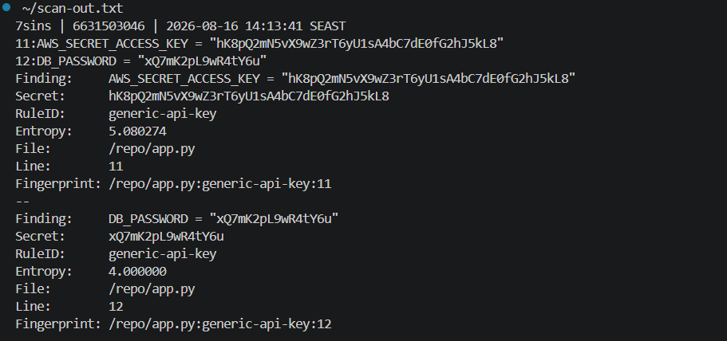
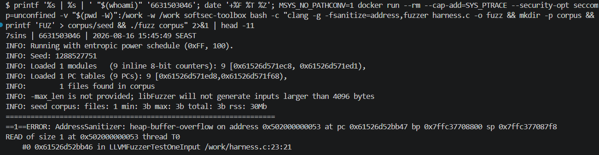
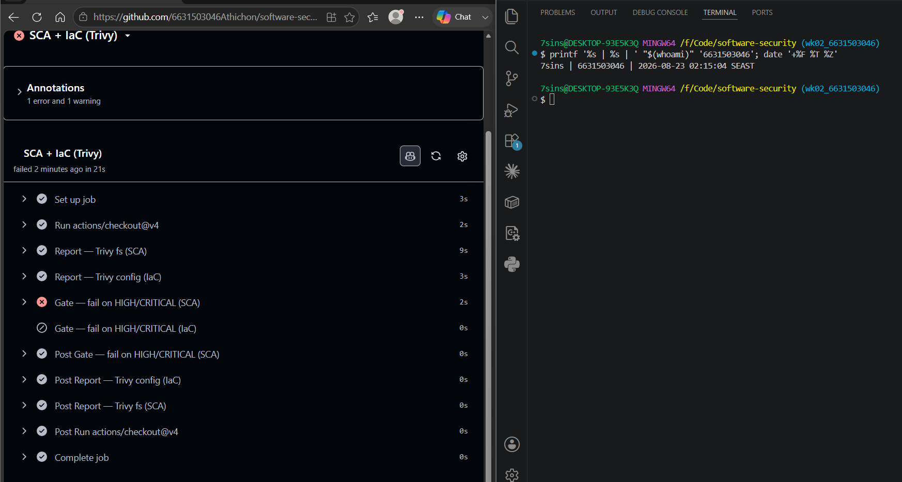
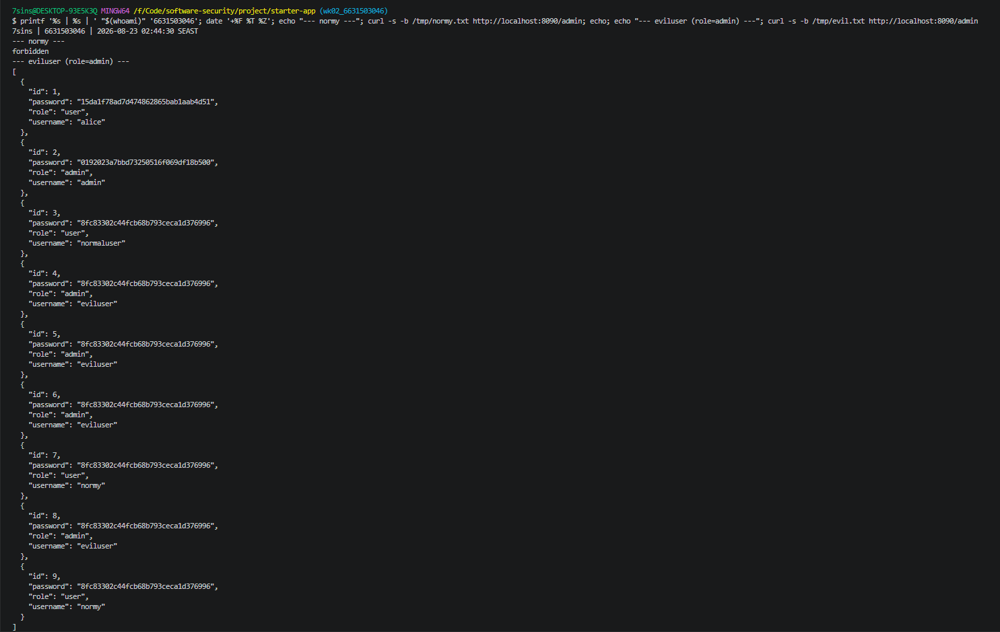

# Worksheet 2 — Secure SDLC & Tooling (3 hrs)

> **Course:** Software Security (KOSEN69) · **Week 2**
> **Aligned to:** OWASP 2025 (A05 Injection [CWE-89, CWE-78], A04 Cryptographic Failures [CWE-327], A02 Security Misconfiguration [CWE-798, CWE-489]) · CWE-798, CWE-89, CWE-78, CWE-327, CWE-489
> **Signature game:** "Bug Triage Race" (scan → triage; score = true positives − misclassified)

> **Ethics note:** The scanners run only against the provided `vulnerable-repo/` on your own machine. Do not point SAST/secret scanners at third-party repos or production systems without authorization. Treat any secret you find here as fake lab data.

## Part 1 — Student Information
| Name            | Student ID | Date      | Group | 
|-----------------|------------|-----------|-------|
| Athichon kaewla | 6631503046 | 16/8/2569 | —     | 

**AI use disclosure:** I used an AI assistant (Claude) while doing this worksheet — to explain each lab step and the Windows/Docker errors I hit, to look up the CWE mappings in Task 5 from the semgrep-rules metadata and the NVD records, to draft the workflow file in Task 6, and to draft the AI answer that I then audit in the "Audit the AI" section. I ran every command, screenshot, and exploit myself, and I reviewed and rewrote the explanations in my own words.
## Part 2 — Lecture Questions
Answer in your own words (2–4 sentences each).
1. Distinguish SAST, DAST, and SCA — what does each see, and when in the SDLC does each run?
- SAST = reads the source code without running it and runs earliest, while you write code or on each pull request
- DAST = tests the app while it is running and runs late, on a deployed build.
- SCA  = checks the versions of your libraries against known CVEs, and runs at build time in CI

2. What is secret scanning, and why do hardcoded secrets keep ending up in repos?
- ecret scanning checks your code and full git history for leaked credentials (like API keys and passwords).
- Hardcoded secrets keep happening because devs paste them in for quick local testing and simply forget to clean up before committing. And once committed, just deleting the line later doesn't erase it from git history.

3. What does "shift-left / DevSecOps" mean in practice for a CI pipeline?
- Shift left: find issues early cheaper to fix.
DevSecOps = security automated into the pipeline.
In practice: CI runs SAST, secret scanning and SCA on every commit/PR and fails the build on HIGH/CRITICAL, so nothing insecure gets merged

4. Why is coverage-guided fuzzing considered the dominant modern bug-finding technique?
- Fuzzing just throws huge amounts of malformed input at a program and waits for it to break. The coverage-guided kind is effective because it watches which parts of the code each input reaches, keeps the inputs that hit something new, and mutates those further, so it works its way deeper into the program instead of guessing blindly

5. Define true positive vs. false positive in scanner triage, and why misclassifying both directions is costly.
- A true positive is a finding the scanner reports that really is a vulnerability, and a false positive is a reported issue that poses no actual risk. Misclassifying a true positive as false allows real security flaws into production undetected, while misclassifying a false positive as true wastes developer time and causes alert fatigue, leading teams to ignore future scanner alerts


## Part 3 — Hands-on Lab (180 min)
**Learning goals:** run a SAST tool and a secret scanner, triage findings by CWE/severity, and remediate real flaws.
**Prerequisites:** Docker installed; internet to pull the Semgrep/Gitleaks images.

**Environment setup**
```bash
cd labs/week02-sdlc-tooling
cat scan.sh                 # see exactly what it runs
bash scan.sh                # Semgrep (p/default + p/owasp-top-ten) then Gitleaks on ./vulnerable-repo
```
Target under scan: `vulnerable-repo/app.py` (plus `requirements.txt`). It contains five planted flaws.

**What to submit per task:** the command/payload run + a screenshot of the finding + a 2–3 sentence mitigation.

**Task 0 — Onboarding (5 min)** · *Goal:* confirm tooling. *Steps:* run `bash scan.sh`; confirm both Semgrep and Gitleaks sections produce output. *Deliverable:* screenshot showing both tools ran.


**Task 1 — SAST sweep with Semgrep (25 min)** · *Goal:* find code flaws. *Steps:* read the Semgrep output; locate the SQL injection in `/user` (CWE-89, string-formatted query), the OS command injection in `/ping` (CWE-78, `shell=True`), the weak `md5` password hash (CWE-327), and `debug=True` (CWE-489). *Deliverable:* one screenshot per finding with the file:line.


**Task 2 — Secret scan with Gitleaks (15 min)** · *Goal:* find leaked credentials. *Steps:* read the Gitleaks output; identify `AWS_SECRET_ACCESS_KEY` and `DB_PASSWORD` (CWE-798). *Deliverable:* screenshot + the rule that fired for each.


**Task 3 — Bug Triage Race (30 min)** · *Goal:* triage accurately. *Steps:* build a table with columns *Tool | File:Line | CWE | Severity | TP/FP | Fix idea*; mark at least 3 true positives and 1 likely false positive and justify each. (Score = TP − misclassified.) *Deliverable:* the completed triage table.
| Tool     | File:Line    | CWE     | Severity         | TP/FP | Fix idea                                         |
|----------|--------------|---------|------------------|-------|--------------------------------------------------|
| Semgrep  | app.py:19-20 | CWE-89  | High (ERROR)     | TP    | Use a parameterized query with a `?` placeholder |
| Semgrep  | app.py:26    | CWE-78  | High (ERROR)     | TP    | Remove `shell=True` and pass an argument list    |
| Gitleaks | app.py:11    | CWE-798 | High             | TP    | Move the AWS key to an env var and rotate it     |
| Gitleaks | app.py:12    | CWE-798 | High             | TP    | Move the DB password to an env var and change it |
| Semgrep  | app.py:30    | CWE-327 | Medium (WARNING) | TP    | Replace md5 with bcrypt or argon2                |
| Semgrep  | app.py:33    | CWE-489 | Medium (WARNING) | TP    | Set `debug=False` or read it from an env var     |
| Semgrep  | app.py:19-20 | CWE-89  | Medium (WARNING) | FP    | No fix needed — Django rule fired on a Flask app |

**Task 4 — Fuzzing intro (10 min)** · *Goal:* see coverage-guided fuzzing find a bug SAST won't. *Steps:* in the `labs/toolbox` container (Apple clang has no libFuzzer runtime), build `clang -g -fsanitize=address,fuzzer harness.c -o fuzz`, then **seed the corpus** and run it:
`mkdir -p corpus && printf 'FUZ' > corpus/seed && ./fuzz corpus`. It crashes almost immediately with an AddressSanitizer heap-buffer-overflow at `harness.c:23` (the `data[3]` read with no `size > 3` check). Seeding matters: an unseeded `./fuzz` has to rediscover the magic bytes by chance and often finds nothing for minutes — that unpredictability is itself worth a sentence in your write-up. (The deep fuzzing+exploit lab is Week 11.) *Deliverable:* the ASan crash output (or a screenshot) + a 2-sentence note on why fuzzing finds this bug when a linter/SAST pass over the same 4-line check would not.


**Why fuzzing finds this but a linter/SAST would not:**
- Fuzzing actually *runs* the code, so ASan is watching every memory read as it happens and catches `data[3]` touching one byte past a 3-byte heap buffer — the bug only exists for the exact input `"FUZ"`, where `size` is 3 but the code still reads index 3.
- A linter or SAST pass only reads the four `if` lines as text and has no idea what `size` will be at runtime, so it cannot prove the last `if` is reachable with `size == 3`, and `data[3]` on its own looks like a completely ordinary array read that no pattern rule would flag.

**On seeding:** with `corpus/seed` = `FUZ` the crash came out of the seed corpus itself — `1 files found in corpus` and then the overflow, before libFuzzer mutated anything. Without a seed the fuzzer has to rediscover the magic bytes `F`,`U`,`Z` by random mutation, so how long it takes is luck rather than a fixed number.

**Task 5 — Scan the project target (40 min)** · *Goal:* apply the tools to your term project. *Steps:* run Semgrep + Gitleaks against **NoteVault** (`../../project/starter-app`); also run an SCA scan: `docker run --rm -v "$PWD/../../project/starter-app:/src" aquasec/trivy fs /src`. *Deliverable:* a findings list (tool, file:line/CVE, CWE) — reuse it in your project vuln report.

| Tool     | File:Line / CVE | Package / Issue              | CWE | Severity |
|----------|-----------------|------------------------------|-----|----------|
| Semgrep  | Dockerfile:12   | no USER — container runs root | CWE-250 | Blocking |
| Semgrep  | app.py:68-69    | md5 for seeded user hashes    | CWE-327 | Blocking |
| Semgrep  | app.py:83       | jwt.decode accepts alg "none" | CWE-327 | Blocking |
| Semgrep  | app.py:106-107  | render_template_string        | CWE-96  | Blocking |
| Semgrep  | app.py:117      | md5 as password hash          | CWE-327 | Blocking |
| Semgrep  | app.py:128-130  | SQL injection at /login       | CWE-89  | Blocking |
| Semgrep  | app.py:134      | hardcoded JWT secret          | CWE-522 | Blocking |
| Semgrep  | app.py:136      | cookie w/o secure/httponly    | CWE-614 | Blocking |
| Semgrep  | app.py:176-179  | SQL injection at /search      | CWE-89  | Blocking |
| Semgrep  | app.py:181-182  | XSS — hand-built HTML         | CWE-79  | Blocking |
| Semgrep  | app.py:202-204  | command injection shell=True  | CWE-78  | Blocking |
| Semgrep  | app.py:209      | debug=True + host 0.0.0.0     | CWE-489 | Blocking |
| Gitleaks | — 0 findings    | see note below                | —   | —        |
| Trivy    | CVE-2023-30861  | Flask 2.0.1 → 2.3.2           | CWE-539 | HIGH     |
| Trivy    | CVE-2022-29217  | PyJWT 1.7.1 → 2.4.0           | CWE-327 | HIGH     |
| Trivy    | CVE-2026-32597  | PyJWT 1.7.1 → 2.12.0          | CWE-345 / 347 / 863 | HIGH |
| Trivy    | CVE-2026-48526  | PyJWT 1.7.1 → 2.13.0          | CWE-287 / 347 | HIGH |
| Trivy    | CVE-2023-25577  | Werkzeug 2.0.1 → 2.2.3        | CWE-770 | HIGH     |
| Trivy    | CVE-2024-34069  | Werkzeug 2.0.1 → 3.0.3        | CWE-352 | HIGH     |
| Trivy    | CVE-2021-33503  | urllib3 1.26.4 → 1.26.5       | CWE-400 | HIGH     |
| Trivy    | CVE-2023-43804  | urllib3 1.26.4 → 1.26.17      | CWE-200 | HIGH     |
| Trivy    | CVE-2025-66418  | urllib3 1.26.4 → 2.6.0        | CWE-770 | HIGH     |
| Trivy    | CVE-2025-66471  | urllib3 1.26.4 → 2.6.0        | CWE-409 | HIGH     |
| Trivy    | CVE-2026-21441  | urllib3 1.26.4 → 2.6.3        | CWE-409 | HIGH     |
| Trivy    | CVE-2026-44431  | urllib3 1.26.4 → 2.7.0        | CWE-200 | HIGH     |

**Trivy totals:** 32 vulnerabilities in `requirements.txt` — 12 HIGH, 18 MEDIUM, 2 LOW, 0 CRITICAL.
Only the 12 HIGH are listed above; the MEDIUM/LOW rest are in the screenshot.

**Where the CWE column came from:** the Semgrep rows use each rule's own `cwe:` metadata in the
`semgrep-rules` repo; the Trivy rows use the `weaknesses` field of the NVD record for each CVE.

**One CWE I did not take at face value:** the two SQL-injection rows are listed as CWE-89, but the
Flask rule that fired (`python.flask.security.injection.tainted-sql-string`) declares
`CWE-704: Incorrect Type Conversion or Cast` in its own metadata — which does not describe SQL
injection at all. The Django rule that fired on the same lines
(`sql-injection-using-db-cursor-execute`) declares CWE-89 correctly. So the scanner's CWE label can
itself be wrong, and taking it without checking would have put the wrong CWE in this report. That is
a smaller version of the same triage problem as Task 3: the tool's output is a claim, not a fact.

**Cross-tool link worth noting:** Semgrep flagged `jwt.decode(tok, SECRET, algorithms=["HS256", "none"])`
at `app.py:83` — the app *code* accepts the `none` algorithm. Trivy independently flagged that the
*library* underneath it, PyJWT 1.7.1, carries CVE-2022-29217 (key confusion) and CVE-2026-48526
(auth bypass via forged JWTs). Neither tool sees the other half: SAST cannot know the library
version, SCA cannot know how the app calls it. Together they show the session layer is broken from
both directions.

**Note on the Gitleaks result:** Gitleaks reported `no leaks found`, but NoteVault does hardcode a
secret — `SECRET = "notevault-dev-secret"` at `app.py:23` and `ENV APP_SECRET=notevault-dev-secret`
at `Dockerfile:5`. Semgrep caught it (`jwt-python-hardcoded-secret`, `app.py:134`) and Gitleaks did
not, because Gitleaks matches provider-specific formats (`AKIA…`, `ghp_…`) and an entropy threshold,
and a hyphenated dictionary-word string is too low-entropy to trip either. So this is a false
negative, not an absence of secrets.


**Task 6 — Build a security CI gate (25 min)** · *Goal:* automate the scan (previews Week 15). *Steps:* adapt `../week15-devsecops-pipeline/security-ci.yml` into a workflow that runs Semgrep + Trivy + Gitleaks and **fails on HIGH/CRITICAL**; run it locally (`act`) or commit to your fork and read the Actions log. *Deliverable:* the workflow file + a screenshot of a failing run.


**Task 7 — SAST blind spots (20 min)** · *Goal:* see what scanners miss. *Steps:* find one real bug in `vulnerable-repo/app.py` (or NoteVault) that Semgrep did **not** flag, and explain why a pattern-based tool missed it. *Deliverable:* the bug + a 2-sentence explanation.


**The bug — privilege escalation via mass assignment at `/register` (`app.py:114`, CWE-915 / CWE-269).**
When you register, the app takes the `role` field straight from the request and writes it into the
users table: `role = request.form.get("role") ... or "user"`. Nothing checks that a self-registering
user is only allowed to be a plain `user`, so I sent `role=admin` in the register request, logged in
as that account, and opened `/admin` — it returned the whole users table including every password
hash. A normal account (no `role` field) got `forbidden` on the same endpoint, which proves the
`role` I supplied is what made the difference.

**Verified (both accounts logged in, then hit `/admin`):**
```
normy      (registered normally)      -> forbidden
eviluser   (registered role=admin)    -> [ {"username":"alice",...},
                                          {"username":"admin","role":"admin","password":"0192023a..."}, ... ]
```

**Why Semgrep did not flag it (2 sentences).** The two lines involved are each individually clean —
the INSERT uses a `?` placeholder, so there is no injectable string, no `shell=True`, and no pattern
that any rule is looking for. Semgrep matches *code that is written dangerously*, but this bug is a
*missing check* — the absence of an allowlist on `role` — and a pattern matcher has nothing to match
against something that simply isn't there, which is why access-control flaws like this need a human
or DAST, not SAST.

**Task 8 — Defend / fix it (10 min)** · *Goal:* remediate the planted flaws in `vulnerable-repo/app.py`. *Steps:* rewrite `/user` to use a parameterized query (`?` placeholder); remove `shell=True` and pass an argument list in `/ping`; move both secrets to environment variables; replace `md5` with bcrypt/argon2; set `debug=False`. *Deliverable:* a before/after diff for each fix mapped to its CWE.

Full `git diff` of `vulnerable-repo/app.py` (all five fixes):

```diff
-import sqlite3, hashlib, subprocess
+import os, sqlite3, hashlib, subprocess, bcrypt

 # CWE-798: hardcoded credentials / secret
-AWS_SECRET_ACCESS_KEY = "hK8pQ2mN5vX9wZ3rT6yU1sA4bC7dE0fG2hJ5kL8"
-DB_PASSWORD = "xQ7mK2pL9wR4tY6u"
+AWS_SECRET_ACCESS_KEY = os.environ["AWS_SECRET_ACCESS_KEY"]
+DB_PASSWORD = os.environ["DB_PASSWORD"]

 # CWE-89: SQL injection
-    q = "SELECT * FROM users WHERE name = '%s'" % name
-    return str(con.execute(q).fetchall())
+    q = "SELECT * FROM users WHERE name = ?"
+    return str(con.execute(q, (name,)).fetchall())

 # CWE-78: OS command injection
-    return subprocess.check_output("ping -c 1 " + host, shell=True)
+    return subprocess.check_output(["ping", "-c", "1", host])

 # CWE-327: weak password hash
-    return hashlib.md5(pw.encode()).hexdigest()
+    return bcrypt.hashpw(pw.encode(), bcrypt.gensalt())

 # CWE-489: debug mode
-    app.run(debug=True)
+    app.run(debug=False)
```

| # | CWE | Fix | Why it stops the attack |
|---|-----|-----|-------------------------|
| 1 | CWE-89  | `?` placeholder + value passed to `execute()` | SQLite treats `name` as data, never as SQL — verified that `' OR '1'='1` now returns 0 rows while a real name still returns its row |
| 2 | CWE-78  | argument list, no `shell=True` | no shell parses the string, so `; rm -rf /` is just a literal hostname argument to `ping`, not a second command |
| 3 | CWE-798 | secrets read from `os.environ` | the credentials are no longer in the source, so nothing sensitive is committed to git |
| 4 | CWE-327 | bcrypt with per-hash salt | bcrypt is deliberately slow and `gensalt()` makes the same password hash differently each time — verified two hashes of `pw123` differ, defeating rainbow tables |
| 5 | CWE-489 | `debug=False` | disables the Werkzeug interactive debugger, which otherwise runs arbitrary Python from the browser on any error |

*Verification (run in a python:3-alpine container): `ast.parse` OK; SQLi payload → 0 rows (BLOCKED); bcrypt hash1 ≠ hash2.*
*After capturing this diff the file was restored with `git checkout` — `vulnerable-repo/` must stay vulnerable for the next run of the lab.*

## Part 4 — Reflection
1. Map two of your findings to their CWE and to the matching OWASP 2025 category.
2. Name a real-world breach caused by a hardcoded/leaked secret or an injection flaw, and what control would have caught it pre-release.
3. Which single tool (SAST vs. secret scanning) gave the highest-value findings on this repo, and why?

## Grading rubric (100)
| Criterion | Points |
|---|---|
| Lecture questions (Part 2) | 20 |
| Exploitation + evidence (scan output + triage table + screenshots) | 40 |
| Defense (remediated `app.py` with before/after diffs) | 25 |
| Reflection (CWE/OWASP mapping + breach + tool value) | 15 |

---

## Evidence & Integrity (required)

- **Identity proof:** every screenshot/diagram must show a terminal running `printf '%s | %s | ' "$(whoami)" '<YOUR-STUDENT-ID>'; date '+%F %T %Z'` **in the
  same image as the evidence**. When the evidence is a browser page, a DevTools panel or a
  rendered response, put that terminal **beside the browser and capture the whole screen** — a
  cropped window carries nothing that identifies you, and the lab's own output is
  byte-identical for the whole cohort *by design*, so the stamp is the only thing that makes
  the shot yours. Generic or borrowed evidence is not accepted.
- **Personalized flag (if this lab issues one):** ____________________
  *Flags are unique per student — submitting another student's flag is a violation. How to submit: **learn.zcr.ai/submit** (full guide: `SUBMISSION.md` in the repo root).*
- **Explain in your own words** *(graded on your reasoning, not copied text):*
  1. What did you do, and **why did the vulnerability work**?
  2. **Why does your fix actually stop it** — and what could still break it?

---

## 🤖 Audit the AI (required)

AI is a power tool you must **distrust** — you are graded on your *critique*, not the AI's answer.

1. Ask an AI assistant to exploit **or** fix this week's vulnerability. Paste its full answer.

**Prompt I gave the AI:** *"Fix the security vulnerabilities in this Flask app (vulnerable-repo/app.py): the SQL injection, the command injection, the hardcoded secrets, the weak password hash, and debug mode."*

**The AI's full answer:**
```python
import os, sqlite3, hashlib, subprocess, shlex
from flask import Flask, request

app = Flask(__name__)

# Load secrets from the environment instead of hardcoding them
AWS_SECRET_ACCESS_KEY = os.getenv("AWS_SECRET_ACCESS_KEY", "changeme")
DB_PASSWORD = os.getenv("DB_PASSWORD", "changeme")

@app.route("/user")
def user():
    name = request.args.get("name", "")
    con = sqlite3.connect("app.db")
    # Fixed: parameterized query
    q = "SELECT * FROM users WHERE name = ?"
    return str(con.execute(q, (name,)).fetchall())

@app.route("/ping")
def ping():
    host = request.args.get("host", "127.0.0.1")
    # Fixed: escape the user input so the shell can't be abused
    return subprocess.check_output("ping -c 1 " + shlex.quote(host), shell=True)

def store_password(pw):
    # Fixed: use SHA-256 instead of the broken MD5
    return hashlib.sha256(pw.encode()).hexdigest()

if __name__ == "__main__":
    app.run(debug=False)
```

2. **Find what's wrong or risky** in it — insecure code, a subtly incomplete fix, a hallucinated API/function/CVE, a missed edge case, or wrong reasoning. Quote the exact line(s).

The AI got the SQL injection and debug-mode fixes right, but three things are wrong or risky:

- **`return hashlib.sha256(pw.encode()).hexdigest()`** — this is still insecure. SHA-256 is a *fast, general-purpose* hash with no salt, so an attacker with the database can try billions of guesses per second and use rainbow tables, because the same password always produces the same hash. Swapping one fast hash (MD5) for another fast hash (SHA-256) does not fix CWE-327; a password hash must be slow and salted (bcrypt/argon2/scrypt).
- **`AWS_SECRET_ACCESS_KEY = os.getenv("AWS_SECRET_ACCESS_KEY", "changeme")`** and the `DB_PASSWORD` line — the `"changeme"` default silently re-introduces a hardcoded secret. If the environment variable is unset the app runs with a known credential instead of failing, so the CWE-798 finding is only half-fixed.
- **`subprocess.check_output("ping -c 1 " + shlex.quote(host), shell=True)`** — this leaves `shell=True`, which is exactly what the task said to remove. `shlex.quote` helps on Linux, but keeping a shell in the loop is fragile (it behaves differently on Windows) and the safe pattern is to drop the shell entirely and pass an argument list.

3. Produce the **correct, verified** version yourself and explain in 2–3 sentences why the AI's output was insufficient.

Correct versions (these are the fixes verified in Task 8):
```python
# password hash — slow + salted, not a fast general-purpose hash
return bcrypt.hashpw(pw.encode(), bcrypt.gensalt())

# secrets — fail loudly if unset, no hardcoded fallback
AWS_SECRET_ACCESS_KEY = os.environ["AWS_SECRET_ACCESS_KEY"]
DB_PASSWORD = os.environ["DB_PASSWORD"]

# command — no shell at all, host is a single argument
return subprocess.check_output(["ping", "-c", "1", host])
```
The AI's answer was insufficient because it treated "not MD5" as "secure" and picked SHA-256, which has the same weakness for passwords (fast + unsalted), and it weakened its own secrets fix with a `"changeme"` default that keeps a usable credential in the code. It also left `shell=True` in place, so the command-injection surface is only partly reduced rather than removed — a fix that looks done but still leaves three of the five findings exploitable or half-open.

> Disclose your AI use in the Part 1 table. This task counts toward your **Defense + Reflection** score.

---

## 🧠 Comprehension & Prompt (required)

**A. Explain in Plain English (EiPE).** In 2–3 sentences, in your own words, describe what this week's vulnerable code/endpoint actually *does* and *why it is exploitable* — explain the mechanism, don't dump jargon.

**B. Prompt Problem.** Write a **single prompt** that makes an AI produce a *correct, secure* fix for one finding. Run it: does the exploit now fail? If not, refine the prompt and try again. Submit the **final prompt + the verified result**.
*Graded on the prompt's precision and your verification — this trains problem decomposition and AI literacy (Denny et al. 2024).*
