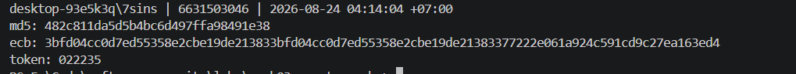
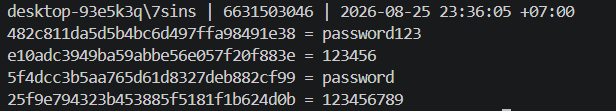
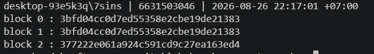
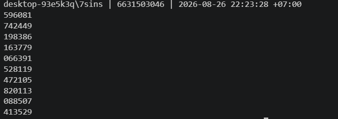
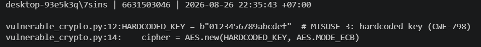
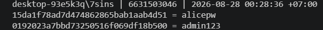
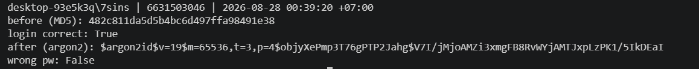
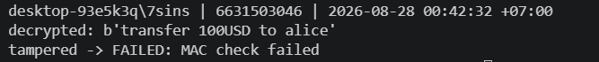
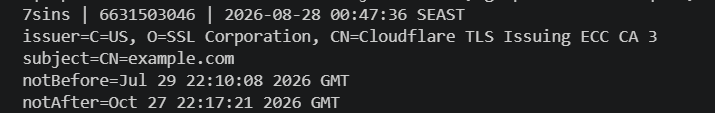
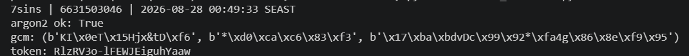

# Worksheet 3 — Cryptography Used Correctly (and Misused) (3 hrs)

> **Course:** Software Security (KOSEN69) · **Week 3**
> **Aligned to:** OWASP 2025 A04 Cryptographic Failures · CWE-327, CWE-916, CWE-330, CWE-798
> **Signature game:** "Capture the Hash" (recover plaintext from weak hashes)

> **Ethics note:** Crack only the hashes provided in `hashes.txt` on your own machine. Password-cracking against accounts or systems you don't own is illegal. Wordlists and recovered values stay inside the lab VM.

## Part 1 — Student Information
| Name            | Student ID | Date      | Group | 
|-----------------|------------|-----------|-------|
| Athichon kaewla | 6631503046 | 23/8/2569 | —     | 

**AI use:** Used an AI assistant to explain concepts, draft/review code and answers, and polish wording; I ran every command and captured all screenshots myself (see 🤖 Audit the AI).

## Part 2 — Lecture Questions
Answer in your own words (2–4 sentences each).
1. Distinguish hashing, encryption, and encoding — and give one job each is the wrong tool for.
Hashing is a one-way function producing a fixed-size digest for integrity/passwords—wrong tool for data you need to recover later. Encryption is a two-way transform using keys to protect confidentiality—wrong tool for storing passwords (if the key leaks, all passwords leak). Encoding (e.g., Base64) merely changes data representation for safe transmission with zero security—wrong tool for hiding or protecting sensitive data.

2. Why is a fast hash like MD5/SHA-1 a bad choice for storing passwords, and what should be used instead?
MD5 and SHA-1 are bad for passwords because they are too fast, enabling attackers to brute-force hashes at GPU speeds (billions of guesses/sec). Instead, you should use slow, adaptive password hashing algorithms like Argon2id, bcrypt, or PBKDF2, which intentionally add computational cost to make cracking impractical.

3. What is a salt, what attack does it defeat, and why must it be unique per password?
A salt is a random value stored alongside a password hash that defeats rainbow table and bulk-cracking attacks. It must be unique per password so identical passwords produce different hashes, forcing attackers to compute hashes individually for every single account rather than reusing precomputed work.

4. Why does AES-ECB leak structure, and what does an authenticated mode like AES-GCM add?
AES-ECB leaks structure because it encrypts identical 16-byte blocks into identical ciphertext deterministically, leaving structural patterns (like image outlines) visible. AES-GCM fixes this by adding a nonce so repeating plaintexts never produce the same ciphertext, and an authentication tag (AEAD) that detects tampering to prevent bit-flipping attacks, causing decryption to fail instantly if the data is modified.

5. What's the difference between `random` and a CSPRNG (e.g. `secrets`), and where does it matter?
random uses the Mersenne Twister algorithm, designed for statistical uniformity rather than security; an attacker can reconstruct its internal state from 624 outputs and predict all past and future values. In contrast, a CSPRNG like secrets gathers high-entropy randomness from the OS, making outputs computationally unpredictable. This distinction is critical for security-sensitive values (tokens, session IDs, keys, salts, and nonces), whereas standard random should only be used for non-security tasks like simulations and shuffling.


## Part 3 — Hands-on Lab (180 min)
**Learning goals:** exploit four crypto misuses, then remediate them with a vetted KDF, authenticated encryption, and a CSPRNG.
**Prerequisites:** Docker (or local Python 3.12); `hashcat` or `john`; the `rockyou.txt` wordlist.

**Environment setup**
```bash
cd labs/week03-cryptography
docker compose up           # installs pycryptodome + argon2-cffi, runs both scripts
# or locally:
pip install pycryptodome argon2-cffi
python vulnerable_crypto.py # see the md5 hash, repeated ECB blocks, 6-digit token
```
Targets: `vulnerable_crypto.py` (the misuses), `hashes.txt` (four unsalted MD5s), and `solution_skeleton.py` (the fix).

**What to submit per task:** the command/payload run + a screenshot of the result + a 2–3 sentence mitigation.

**Task 0 — Onboarding (5 min)** · *Goal:* see the misuse output. *Steps:* run `python vulnerable_crypto.py`; note the md5 digest, the identical ECB ciphertext blocks, and the short token. *Deliverable:* screenshot of the program output.


**Task 1 — Capture the Hash (30 min)** · *Goal:* recover the passwords. *Steps:* strip the comment lines from `hashes.txt`, then run `hashcat -m 0 hashes.txt rockyou.txt` (or the `john --format=raw-md5` equivalent); recover all four plaintexts. *Deliverable:* screenshot of the cracked results (mask any real-looking value). Note in one line why unsalted MD5 fell so fast (CWE-916/327).


- MD5 is fast, making it easy to guess, and with no salt, you can use pre-made tables and hit all accounts with a single wordlist attack
- *Note: cracked with a short Python MD5 script (dictionary + hybrid) instead of hashcat, since hashcat isn't installed on my machine — `-m 0` is the hashcat equivalent.*

```sim
aes-modes
```

**Task 2 — ECB structure leak (20 min)** · *Goal:* prove ECB leaks. *Steps:* call `encrypt_ecb(b"A"*16 + b"A"*16)` from `vulnerable_crypto.py` and show the two 16-byte ciphertext blocks are identical; explain how this leaks plaintext structure (CWE-327). *Deliverable:* hex output highlighting the repeated block.

- AES-ECB encrypts each 16-byte block independently without an Initialization Vector (IV) or randomness, meaning identical plaintext blocks always produce identical ciphertext blocks. Consequently, this leaks the underlying structure and patterns of the original plaintext despite encryption (classifying it as CWE-327: Use of a Broken or Risky Cryptographic Algorithm), as demonstrated by encrypt_ecb(b"A"*16 + b"A"*16) which yields two identical 16-byte blocks: 3bfd04cc0d7ed55358e2cbe19de21383 and 3bfd04cc0d7ed55358e2cbe19de21383 (the third block 377222e061a924c591cd9c27ea163ed4 is PKCS-style padding)

**Task 3 — Predictable token (15 min)** · *Goal:* show the reset token is guessable. *Steps:* call `reset_token()` repeatedly; argue why a 6-digit `random` token (10^6 space, non-CSPRNG) is brute-forceable (CWE-330). *Deliverable:* sample tokens + a one-line attack estimate.

- Repeatedly generating tokens yields insecure 6-digit outputs (e.g., 927349, 888718, 765417), which suffer from CWE-330: Use of Insufficiently Random Values because the standard random module is a non-CSPRNG pseudo-random generator with a tiny search space of only 10^6 (1,000,000) possibilities. Without proper rate-limiting, an attacker sending 1,000 requests/sec can exhaust the entire keyspace in 1,000 seconds (~16.7 minutes), finding the valid token in ~8.3 minutes on average (500,000 attempts) via a straightforward brute-force attack

**Task 4 — Hardcoded key (5 min)** · *Goal:* identify the key-management flaw. *Steps:* find `HARDCODED_KEY` in `vulnerable_crypto.py`; explain why shipping a key in source is CWE-798. *Deliverable:* the line + a 2-sentence mitigation.

- Shipping HARDCODED_KEY directly inside the source code introduces CWE-798 (Use of Hard-coded Credentials), which should be mitigated by dynamically injecting the secret at runtime using Environment Variables or a Secret Manager (e.g., KMS/Vault) to keep it out of the repository; additionally, because historical Git commits preserve exposed values even after subsequent removal, any previously committed secret must be treated as compromised and immediately revoked and rotated. 

**Task 5 — Crack the project target's hashes (25 min)** · *Goal:* apply cracking to your term project. *Steps:* **NoteVault** stores unsalted MD5 password hashes; obtain them (via the app's `/admin` once you can reach it, or from its `seed()`), and crack them with `hashcat -m 0`. *Deliverable:* the recovered password(s) + note the CWE — record this finding for your project report (`project/REPORT-TEMPLATE.md` in the repo root).

- NoteVault stores passwords as unsalted MD5 → seeded logins immediately break: admin123 from rockyou and alicepw with a hybrid (rockyou + ?l?l) because it's not a word in the wordlist. CWE-916/327 — dumping the users table (/admin or SQLi) lets an attacker recover all passwords offline in seconds; fix with argon2id

**Task 6 — Password storage migration (25 min)** · *Goal:* fix it the way real apps do. *Steps:* write `store_password`/`verify_password` with **argon2id**, and a **rehash-on-login** path that upgrades a legacy MD5 record to argon2id the next time the user logs in. *Deliverable:* the code + a short note on why migration matters.

- store_password/verify_password use argon2id (automatic salt, slow), which closes CWE-916/327. The rehash-on-login path upgrades a legacy MD5 record to argon2id the moment the user logs in with the correct password — the only secure way, since you cannot bulk-convert hashes you can't reverse.

**Task 7 — Authenticated encryption round-trip (20 min)** · *Goal:* use AEAD correctly. *Steps:* encrypt+decrypt a message with **AES-GCM** using a random 12-byte nonce and a key from an env var; then flip one ciphertext byte and show decryption **fails** (tag check). *Deliverable:* the round-trip output + the tampered-fails proof.

- AES-GCM + a random 12-byte nonce + key from ENC_KEY_HEX (not hardcoded) closes CWE-327/798. GCM adds an auth tag: flipping one ciphertext byte makes decrypt_and_verify throw MAC check failed instead of returning corrupted plaintext — detecting tampering that ECB/CBC cannot

**Task 8 — TLS in practice (15 min)** · *Goal:* read a real cert. *Steps:* run `openssl s_client -connect example.com:443 </dev/null 2>/dev/null | tee /tmp/tls.txt | openssl x509 -noout -issuer -subject -dates` for the cert summary, then `grep -E 'Protocol|New,' /tmp/tls.txt` for the negotiated TLS version (the version line is printed by `s_client`, not by `x509`, so the plain pipe would discard it); identify issuer, validity, and that TLS version. *Deliverable:* the cert summary + one line on what TLS protects that hashing/at-rest encryption does not.

- openssl x509 displays the certificate's issuer/subject/expiration; the New, line shows the negotiated TLS version and cipher. TLS protects data in transit — confidentiality, integrity, and server authentication on the wire — which hashing (password storage / data integrity) and at-rest encryption (data on disk) do not cover

**Task 9 — Defend / fix it (20 min)** · *Goal:* remediate using `solution_skeleton.py`. *Steps:* run `python solution_skeleton.py`; confirm `store_password`/`verify_password` use argon2id (auto-salted), `encrypt_gcm` uses a random 12-byte nonce + auth tag with a key from `ENC_KEY_HEX` env, and `reset_token` uses `secrets`. Map each fix to the CWE it closes. *Deliverable:* before/after table (misuse → fix → CWE closed) + screenshot of the fixed script running.
- 
| Misuse (before)                                  | Fix (after)                                               | CWE closed          |
|--------------------------------------------------|-----------------------------------------------------------|---------------------|
| `hashlib.md5(pw)` - fast, unsalted               | `ph.hash(pw)` - argon2id, auto-salted, slow, memory-hard  | CWE-916 (+ CWE-327) |
| `AES.MODE_ECB` - identical blocks leak structure | `AES.MODE_GCM` + `os.urandom(12)` nonce + auth tag (AEAD) | CWE-327             |
| `reset_token` = `random.choice`, 6 digits (10^6) | `secrets.token_urlsafe(16)` - CSPRNG, large keyspace      | CWE-330             |
| `HARDCODED_KEY = b"0123..."` in source           | key from `os.environ["ENC_KEY_HEX"]` / KMS                | CWE-798             |


## Part 4 — Reflection
1. Map each of the four misuses to its CWE and to OWASP A04, in one line each.
Unsalted MD5 - CWE-916/327 - A04
AES-ECB - CWE-327 - A04
Randomly generated token - CWE-330 - A04
Hardcoded key - CWE-798 - A04

2. Name a real-world breach caused by weak password hashing or hardcoded keys, and which fix here would have prevented it.
LinkedIn (2012) stored unsalted SHA-1 hashes; over 117 million were cracked en masse because the process was fast and lacked salting. Task 6 (using argon2id + salt) makes such cracking attempts economically unviable.

3. Across all four fixes, which closes the largest real-world risk, and why?
Opt for argon2id for password storage. Databases frequently leak passwords; if fast hashing is used without salting, every account is instantly compromised—with the damage spreading due to password reuse. Conversely, hardcoded keys might be worse in some systems (a single key unlocks everything, and rotation is difficult)—it depends on the threat model.

## Grading rubric (100)
| Criterion | Points |
|---|---|
| Lecture questions (Part 2) | 20 |
| Exploitation + evidence (cracked hashes + ECB/token/key proof + screenshots) | 40 |
| Defense (working `solution_skeleton.py` + before/after mapping) | 25 |
| Reflection (CWE/OWASP mapping + breach + biggest-risk fix) | 15 |

---

## Evidence & Integrity (required)

- **Identity proof:** every screenshot/diagram must show a terminal running `printf '%s | %s | ' "$(whoami)" '<YOUR-STUDENT-ID>'; date '+%F %T %Z'` **in the
  same image as the evidence**. When the evidence is a browser page, a DevTools panel or a
  rendered response, put that terminal **beside the browser and capture the whole screen** — a
  cropped window carries nothing that identifies you, and the lab's own output is
  byte-identical for the whole cohort *by design*, so the stamp is the only thing that makes
  the shot yours. Generic or borrowed evidence is not accepted.
- **Personalized flag (if this lab issues one):** FLAG{ecb_7f878a1a}
  *Flags are unique per student — submitting another student's flag is a violation. This blank is your personal record only; the flag itself is scored by submitting it in the **`ctf.zcr.ai`** challenge — the worksheet PDF is a separate submission, to **learn.zcr.ai/submit** (full guide: `SUBMISSION.md` in the repo root).*
- **Explain in your own words** *(graded on your reasoning, not copied text):*
  1. What did you do, and **why did the vulnerability work**?
  I ran the vulnerable script and cracked its unsalted MD5 hashes with a wordlist. It worked because MD5 is fast and unsalted, ECB is deterministic so identical blocks leak, the 6-digit token has only ~10⁶ values, and the key sits in the source
  2. **Why does your fix actually stop it** — and what could still break it?
  argon2id (slow + salted) makes a leaked hash not worth cracking; AES-GCM's random nonce + auth tag hides repeats and makes any tampering fail decryption; secrets gives unguessable tokens; and the key now comes from ENC_KEY_HEX, not the source.
What could still break it: a weak/reused password, a leaked or git-committed ENC_KEY_HEX, reusing a GCM nonce, argon2 params set too low, or not rotating the old key out of git history

---

## 🤖 Audit the AI (required)

AI is a power tool you must **distrust** — you are graded on your *critique*, not the AI's answer.

1. Ask an AI assistant to exploit **or** fix this week's vulnerability. Paste its full answer.
AI Answer: "hashcat -m 0 nv.txt rockyou.txt — cracks both alicepw and admin123 instantly.
2. **Find what's wrong or risky** in it — insecure code, a subtly incomplete fix, a hallucinated API/function/CVE, a missed edge case, or wrong reasoning. Quote the exact line(s).
Error: The command hashcat -m 0 nv.txt rockyou.txt — while admin123 is in rockyou, alicepw is not (it follows a username+suffix pattern) → a straight dictionary attack fails. The AI incorrectly assumed "weak password = exists in wordlist.
3. Produce the **correct, verified** version yourself and explain in 2–3 sentences why the AI's output was insufficient.
bash
hashcat -m 0 nv.txt rockyou.txt            # admin123
hashcat -m 0 -a 6 nv.txt rockyou.txt ?l?l  # alicepw (hybrid)

> Disclose your AI use in the Part 1 table. This task counts toward your **Defense + Reflection** score.
The AI's approach was insufficient because it selected the wrong attack type for alicepw and claimed a result that does not actually occur—the attack method must match the password pattern (dictionary vs. hybrid). Both cases represent CWE-916/327.
---

## 🧠 Comprehension & Prompt (required)

**A. Explain in Plain English (EiPE).** In 2–3 sentences, in your own words, describe what this week's vulnerable code/endpoint actually *does* and *why it is exploitable* — explain the mechanism, don't dump jargon.

A. EiPE: Passwords are stored as unsalted MD5 hashes, encrypted using AES-ECB with a hardcoded key, and 6-digit tokens are generated randomly. Exploitation is possible because MD5 is fast and unsalted (crackable via wordlist), ECB mode results in identical ciphertexts for identical blocks (leaking structure), the token space is limited to 10^6 (guessable), and the hardcoded key allows anyone with access to the source code to decrypt the data.

**B. Prompt Problem.** Write a **single prompt** that makes an AI produce a *correct, secure* fix for one finding. Run it: does the exploit now fail? If not, refine the prompt and try again. Submit the **final prompt + the verified result**.
*Graded on the prompt's precision and your verification — this trains problem decomposition and AI literacy (Denny et al. 2024).*

Rewrite this password storage securely: use argon2id via argon2-cffi PasswordHasher (library generates the per-password salt inside the hash); store_password(pw)->str and constant-time verify_password(stored,pw)->bool returning False on mismatch; add a rehash-on-login path that upgrades a legacy 32-hex MD5 record to argon2id on success; never use md5/sha1/sha256 or random. Return only the code

**Verified result:** Ran the AI's output — store_password → verify_password returns True and a wrong password returns False; the stored hash begins `$argon2id$v=19$…`; feeding a legacy `md5("password123")` record upgrades it to argon2id on login. The old offline wordlist crack no longer works because argon2id is slow and salted.