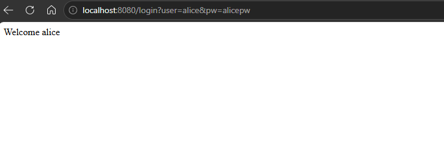
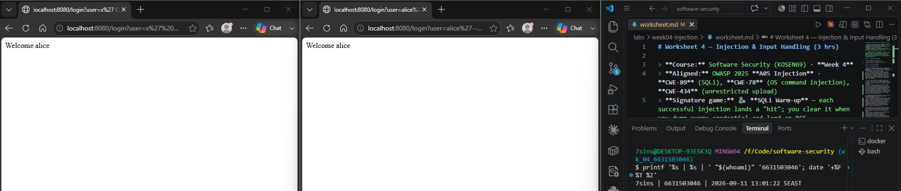
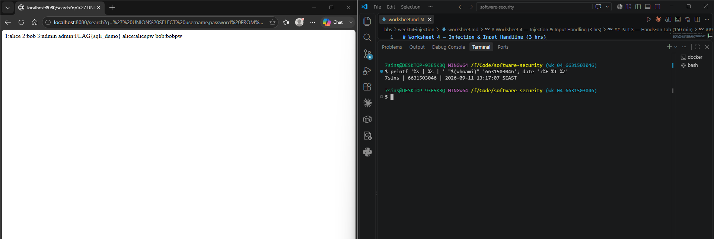
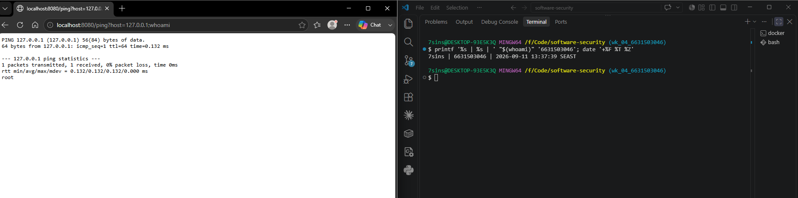
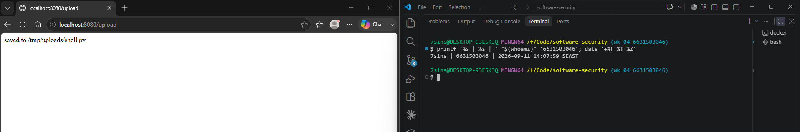
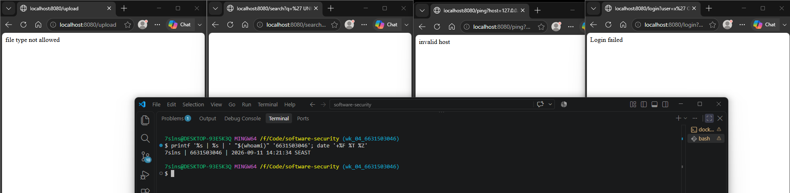

# Worksheet 4 — Injection & Input Handling (3 hrs)

> **Course:** Software Security (KOSEN69) · **Week 4**
> **Aligned:** OWASP 2025 **A05 Injection** · **CWE-89** (SQLi), **CWE-78** (OS command injection), **CWE-434** (unrestricted upload)
> **Signature game:** 🐉 **SQLi Warm-up** — each successful injection lands a "hit"; you clear it when you dump every credential and land an RCE.

> ⚠️ **Ethics note:** All payloads here are for the provided sandbox (`vulnerable_app.py`) and your own DVWA/Juice Shop containers **only**. Never test systems you do not own or have written permission to test. Unauthorized injection is a crime under most computer-misuse laws.

## Part 1 — Student Information

| Name | Student ID | Date | Group |
|------|-----------|------|-------|
| Athichon kaewla | 6631503046 | 9/9/2569 | — |

## Part 2 — Lecture Questions

Answer in 2–4 sentences each.

1. Why does a **parameterized query** (`execute(sql, (params,))`) defeat SQL injection, while string formatting (`"... '%s'" % user`) does not? Reference how the database treats data vs. code.
- String formatting involves embedding user input directly into the SQL command itself, meaning the database might misinterpret that input as an actual SQL command. In contrast, parameterized queries separate the SQL command from the user input; even if the input contains special characters, the system treats them merely as data rather than interpreting them as SQL commands

2. In the `/ping` endpoint, `subprocess.run("ping -c 1 " + host, shell=True)` is vulnerable. Explain how `shell=True` turns user input into **CWE-78**, and how an argument array (`["ping","-c","1",host]`) removes the shell.
- Setting `shell=True` causes the entire command string to be interpreted by the shell (e.g., `sh`). This allows special characters—such as semicolons—to act as command separators, potentially enabling user input to be executed as unintended commands; this constitutes the CWE-78 vulnerability. Conversely, if you use an argument array and set `shell=False`, the `ping` command is executed directly without invoking the shell, meaning special characters are treated merely as ordinary data values

3. Distinguish **input validation** (allow-list) from **output handling**. Why is validation alone insufficient defense for SQLi?
- Input validation involves checking the type, length, range, and format against expected values using an allow-list. However, validation alone is insufficient because one filter cannot guard three different grammars. Each sink requires protection tailored to its specific interpreter: SQL queries must use parameterized queries, while OS commands must use argument vectors with shell=False to ensure data remains strictly separated from code

4. The `/upload` route saves any filename to disk (**CWE-434**). What two properties must a directory and a filename have for an upload to become remote code execution, and which does `solution_app.py` remove?
- Unrestricted file uploads can lead to Remote Code Execution (RCE) if the upload directory is web-accessible and capable of executing scripts—specifically when uploaded files have extensions that the server is configured to execute. The solution in `solution_app.py` addresses this by sanitizing filenames and employing an allow-list to restrict uploads to safe extensions; scripts such as `.py` files are blocked, resulting in a 400 response

5. What is a **UNION-based** SQLi, and why must the injected `SELECT` return the same number of columns as the original query? Relate to `/search?q=' UNION SELECT username,password FROM users--`.

- Union-based SQL injection involves using a `UNION SELECT` statement to retrieve data from another table and display it alongside the original query results. For instance, an attacker might inject `UNION SELECT username, password FROM users` into a search field to force the usernames and passwords to appear directly on the search results page.


## Part 3 — Hands-on Lab (150 min)

**Learning goals:** extract data via SQLi, achieve OS command injection, exploit an unrestricted upload, then prove each fix in `solution_app.py` blocks the payload.

**Prerequisites:** Docker + Docker Compose, `curl`, a browser. Working dir: `labs/week04-injection/`.

### Environment setup

```bash
cd labs/week04-injection
docker compose up            # builds python:3.12-slim, installs flask, runs vulnerable_app.py
# vulnerable app -> http://localhost:8080   (service name: injection-lab, port 8080)
```
Optional secondary targets:
```bash
docker run --rm -it -p 80:80 vulnerables/web-dvwa        # DVWA  -> http://localhost
docker run --rm -p 3000:3000 bkimminich/juice-shop       # Juice Shop -> http://localhost:3000
```

**What to submit per task:** the exact **payload/command**, a **screenshot** of the response proving success, and a **2–3 sentence mitigation** in your own words.

---

**Task 0 — Onboarding (5 min).** Browse to `http://localhost:8080/login?user=alice&pw=alicepw` and confirm `Welcome alice`. Note the seeded users (`alice`, `bob`). Screenshot the working app. *Deliverable: screenshot.*


**Before you start — see why concatenation is the flaw** 🔬 Type any input and watch which characters the database will parse as *SQL* rather than as a name. The point is not the payload; it is that with concatenation the input becomes syntax, and with a parameterised query it structurally cannot. You will be asked to state that difference in your own words in Task 5.

```sim
sqli-parse
```

**Task 1 — Auth bypass via SQLi (25 min) 🐉 Hit #1.**
- *Goal:* log in as `alice` with **no valid password**.
- *Steps:* hit `/login?user=alice'--&pw=x`, then `/login?user=x' OR '1'='1'--&pw=x` (the trailing `--` is required: without it, SQL binds `AND` tighter than `OR`, so `... OR '1'='1' AND password='x'` matches no row). Observe the comment in the query at lines 61–63 of `vulnerable_app.py`.
- *Deliverable:* both URLs + screenshot of `Welcome alice` + explain why `--` and `OR '1'='1` work.

The login endpoint is vulnerable because it inserts user input directly into the SQL query using string formatting. The payload uses `OR '1'='1'` to create an always-true condition, while `--` comments out the password check, allowing login without a valid password. This can be prevented by using parameterized queries, which bind the input as data rather than interpreting it as SQL code.

**Task 2 — Credential dump via UNION SQLi (30 min) 🐉 Hit #2.**
- *Goal:* exfiltrate every username **and password** from the `users` table.
- *Steps:* request `/search?q=' UNION SELECT username,password FROM users--`. Confirm `alice:alicepw` and `bob:bobpw` appear.
- *Deliverable:* payload + screenshot of dumped credentials + note on why column count must match.

 - The original query selects two columns, id and username. Therefore, the injected UNION SELECT must also return two columns, such as username and password, because UNION can only combine result sets with the same number of compatible columns. If the column counts do not match, the database rejects the query and returns an error

**Task 3 — OS command injection (30 min) 🐉 Hit #3.**
- *Goal:* run an arbitrary command through `/ping`.
- *Steps:* request `/ping?host=127.0.0.1;id` then `/ping?host=127.0.0.1;whoami` (URL-encode if needed). Capture the injected command's output.
- *Deliverable:* both payloads + screenshot of `id`/`whoami` output + explanation of the `shell=True` flaw (CWE-78).

- The endpoint is vulnerable because shell=True allows the shell to interpret special characters in user input. The semicolon separates the original ping command from the injected id or whoami command, causing both commands to execute. This can be prevented by using an argument array with shell=False and validating the host against an allow-list

**Task 4 — Unrestricted upload (25 min) 🐉 Hit #4.**
- *Goal:* show the upload accepts a dangerous file type with no checks (CWE-434).
- *Steps:* `GET /upload` (form), then upload a file named `shell.py`. Confirm `saved to /tmp/uploads/shell.py`. Discuss: if `UPLOAD_DIR` were web-served or executed, this is the RCE chain (here the dir is **not** served, so document the missing control rather than claiming auto-RCE).
- *Deliverable:* upload command/screenshot + 2–3 sentences on why extension allow-listing matters.

I used the upload form at /upload to upload a file named shell.py
The upload endpoint accepts files without checking their extensions, allowing executable scripts such as .py or .php to be stored on the server. In this lab, the upload directory is not web-served, so uploading shell.py does not automatically achieve RCE; however, the missing extension allow-list remains a security weakness. The server should sanitize filenames and allow only approved file types such as .txt, .png, .jpg, and .pdf.

**Task 5 — Defend / fix it (35 min) 🛡️ Warm-up cleared.**
- *Goal:* prove `solution_app.py` blocks Tasks 1–4.
- *Steps:* stop the vulnerable container (`Ctrl-C`), then run the fixed app on the same compose env:
  ```bash
  docker compose run --rm --service-ports injection-lab bash -c "pip install --no-cache-dir flask && python solution_app.py"
  ```
  Re-fire each payload from Tasks 1–4. Expected: `Login failed`, no credential dump, `invalid host` (400) on `127.0.0.1;id`, and `file type not allowed` for `shell.py`.
- *Deliverable:* screenshots of all four failures + name the fix line for each (parameterized query L52–55 login / L62–66 search, `shell=False`+regex L74–77, `secure_filename`+allow-list L86–93).

Task 1: Fixed with a parameterized query at solution_app.py.py_app.py:52–55, so user input is bound as data instead of SQL code.
Task 2: Fixed with a parameterized LIKE query at solution_app.py:62–66, preventing the injected  UNION SELECT` from changing the query structure.
Task 3: Fixed with a host regex allow-list and shell=False`` at solution_app.py:74–77`, so shell metacharacters cannot execute another command.
Task 4: Fixed with secure_filename() and an extension allow-list at solution_app.py:86–93, blocking executable file extensions and unsafe filenames.

I tested SQL injection by inserting SQL syntax into the login and search parameters, command injection by adding shell commands after a semicolon in the host parameter, and unrestricted upload by uploading a file named shell.py. These attacks worked because the vulnerable application directly inserted user input into SQL and shell command strings, while the upload route accepted and saved files without validating their names or extensions.

The fixed application uses parameterized queries to keep user input separate from SQL code and uses an argument array with shell=False so shell metacharacters are not interpreted as commands. It also applies a host allow-list, sanitizes uploaded filenames, and restricts allowed extensions. However, extension checks alone cannot verify a file’s real contents, so uploaded files should also be inspected, renamed by the server, and stored outside any directory where the web server can execute them.
## Part 4 — Reflection

1. **CWE/OWASP mapping:** map each of your four exploits to its CWE (89/78/434) and to OWASP 2025 **A05 Injection**.
Tasks 1 and 2 demonstrate SQL injection and map to CWE-89: Improper Neutralization of Special Elements used in an SQL Command. Task 3 demonstrates OS command injection and maps to CWE-78, while Task 4 demonstrates unrestricted file upload and maps to CWE-434. These vulnerabilities are categorized under OWASP Top 10 2025 A05: Injection

2. **Real breach:** the **2017 Equifax breach** exposed ~147M people after attackers exploited a known input-handling flaw (Apache Struts CVE-2017-5638). In 3–4 sentences, connect that failure to the lessons in this lab (untrusted input reaching a powerful interpreter; the cost of an unpatched/unvalidated input path).
The 2017 Equifax breach occurred when attackers exploited the known Apache Struts vulnerability CVE-2017-5638, affecting approximately 147 million people. The vulnerability allowed malicious input to reach a powerful interpreter and be executed as code, similar to how untrusted input reaches the SQL engine or operating-system shell in this lab. Although a patch was available, Equifax failed to apply it to the affected system in time. This incident shows that untrusted input paths must be secured with appropriate controls and known vulnerabilities must be patched promptly

3. **Best mitigation:** of parameterized queries, allow-list validation, least privilege, and avoiding `shell=True`, which single control would have prevented the most damage in this lab, and why?
Parameterized queries would have prevented the most damage in this lab because they block both the authentication bypass in Task 1 and the credential extraction in Task 2. They keep user input separate from SQL syntax, so payloads containing ', --, or UNION SELECT are treated only as data and cannot change the query structure. This also prevents the most serious demonstrated impact: exposing all usernames and passwords from the database

## Grading rubric (100)

| Criterion | Points |
|-----------|-------:|
| Part 2 — Lecture questions (conceptual accuracy) | 20 |
| Part 3 — Exploitation + evidence (payloads + screenshots, Tasks 1–4) | 40 |
| Part 3 — Defense (Task 5: fixes proven, lines cited) | 25 |
| Part 4 — Reflection (CWE/OWASP mapping, breach, mitigation) | 15 |
| **Total** | **100** |

---

## Evidence & Integrity (required)

- **Identity proof:** every screenshot/diagram must show a terminal running `printf '%s | %s | ' "$(whoami)" '<YOUR-STUDENT-ID>'; date '+%F %T %Z'` **in the
  same image as the evidence**. When the evidence is a browser page, a DevTools panel or a
  rendered response, put that terminal **beside the browser and capture the whole screen** — a
  cropped window carries nothing that identifies you, and the lab's own output is
  byte-identical for the whole cohort *by design*, so the stamp is the only thing that makes
  the shot yours. Generic or borrowed evidence is not accepted.
- **Personalized flag (if this lab issues one):** ____________________
  *Flags are unique per student — submitting another student's flag is a violation. This blank is a
  record for your worksheet PDF only — the flag is actually **scored** by submitting it in the
  arena challenge itself at **ctf.zcr.ai**. (Worksheet PDF → **learn.zcr.ai/submit**; full guide:
  `SUBMISSION.md` in the repo root.)*
- **Explain in your own words** *(graded on your reasoning, not copied text):*
  1. What did you do, and **why did the vulnerability work**?
  - I bypassed the login using SQL injection, extracted credentials with UNION SELECT, executed operating-system commands through the ping endpoint, and uploaded a script file. These attacks worked because the application passed untrusted input directly into SQL queries, shell commands, or file paths without safely separating data from executable syntax or restricting the accepted files.
  2. **Why does your fix actually stop it** — and what could still break it?
  - The fixes use parameterized queries to bind SQL values as data, an argument array with shell=False and host validation to prevent shell interpretation, and secure_filename() with an extension allow-list to restrict uploads. However, the host allow-list may still permit requests to internal systems, and checking only the file extension does not confirm the file's real contents. Uploaded files should therefore be inspected and stored outside directories where the web server could execute them.

---

## 🤖 Audit the AI (required)

AI is a power tool you must **distrust** — you are graded on your *critique*, not the AI's answer.

1. Ask an AI assistant to exploit **or** fix this week's vulnerability. Paste its full answer.
2. **Find what's wrong or risky** in it — insecure code, a subtly incomplete fix, a hallucinated API/function/CVE, a missed edge case, or wrong reasoning. Quote the exact line(s).
3. Produce the **correct, verified** version yourself and explain in 2–3 sentences why the AI's output was insufficient.

> Disclose your AI use in the Part 1 table. This task counts toward your **Defense + Reflection** score.

**1. Prompt I gave the AI**

```
Fix the command injection vulnerability in this Flask endpoint:

host = request.args.get("host", "127.0.0.1")
out = subprocess.run("ping -c 1 " + host, shell=True,
                     capture_output=True, text=True)

Validate the host before executing the ping command.
```

**2. Full AI answer** (line numbers added for reference)

```
1  import re
2
3  host = request.args.get("host", "127.0.0.1")
4  if not re.match(r"[A-Za-z0-9_.-]+", host):
5      return "invalid host\n", 400
6  out = subprocess.run("ping -c 1 " + host, shell=True,
7                       capture_output=True, text=True)
8  return "<pre>%s</pre>" % (out.stdout + out.stderr)
```

**3. What is wrong or risky (lines 4 and 6)**

- Line 4: `re.match()` checks only the beginning of the input, so a value beginning with a valid hostname may still contain malicious characters afterward.
- Line 6: The code continues to use `shell=True`, which unnecessarily sends the complete command string to a shell.
- For example, an input that begins with a valid hostname but has a dangerous suffix such as `127.0.0.1;id` still passes `re.match()` because it only checks the start, and `shell=True` then lets the shell interpret the special characters.

**4. Corrected, verified version**

```
import re

host = request.args.get("host", "127.0.0.1")

if not re.fullmatch(r"[A-Za-z0-9_.-]+", host):
    return "invalid host\n", 400

out = subprocess.run(
    ["ping", "-c", "1", host],
    shell=False,
    capture_output=True,
    text=True,
)

return "<pre>%s</pre>" % (out.stdout + out.stderr)
```

**5. Why the AI's output was insufficient**

The AI's fix was insufficient because `re.match()` validated only the beginning of the input, and the command was still executed with `shell=True`. I replaced it with `re.fullmatch()` so the entire hostname must follow the allow-list, and used an argument array with `shell=False` to prevent shell metacharacters from being interpreted. The original command-injection payload `127.0.0.1;id` was then rejected with `invalid host` and status 400.

---

## 🧠 Comprehension & Prompt (required)

**A. Explain in Plain English (EiPE).** In 2–3 sentences, in your own words, describe what this week's vulnerable code/endpoint actually *does* and *why it is exploitable* — explain the mechanism, don't dump jargon.

The /ping endpoint takes a hostname supplied by the user, adds it to a ping command, and asks the operating-system shell to execute the resulting string. It is exploitable because the shell interprets special characters such as semicolons, allowing the user to append and execute another operating-system command

**B. Prompt Problem.** Write a **single prompt** that makes an AI produce a *correct, secure* fix for one finding. Run it: does the exploit now fail? If not, refine the prompt and try again. Submit the **final prompt + the verified result**.
*Graded on the prompt's precision and your verification — this trains problem decomposition and AI literacy (Denny et al. 2024).*

Fix only the command-injection vulnerability in the Flask /ping endpoint below. Do not construct a command string and do not invoke a shell. Validate the entire host value with re.fullmatch using an allow-list that permits only letters, digits, dots, underscores, and hyphens; return HTTP 400 with "invalid host" when validation fails. Execute ping using a subprocess argument list with shell=False. Preserve the existing response format, and explain how to verify that the payload 127.0.0.1;id is rejected
